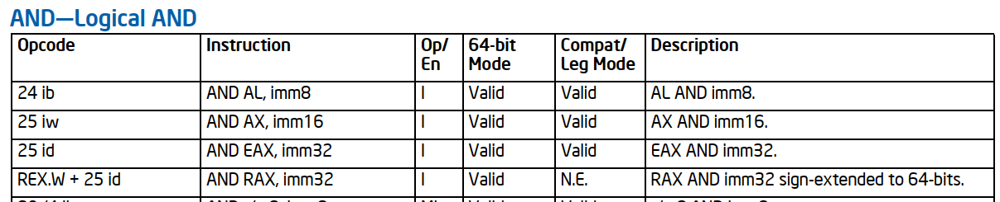
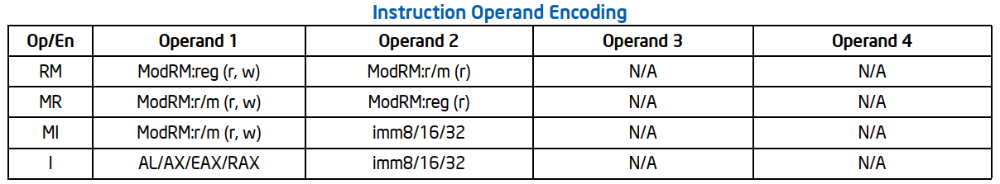

# Summary
[summary]: #summary

This RFC proposes to separate Cranelift's assembler functionality, currently located in the
`cranelift-codegen` crate, into separate assembler-specific crates, `cranelift-assembler-*`.
Currently, the lowering rules in ISLE accept CLIF instructions and emit `MInst` variants; frequently
in the x64 backend, these variants represent __"categories"__ of instructions (e.g., `AluRmiR`,
`UnaryRmRImmVex`). These "categories" abstract over groups of instructions that have a similar
machine code emission. The end result of this proposal would be to auto-generate specific
instructions and lower from CLIF to these instructions, replacing `MInst` "categories."

# Motivation
[motivation]: #motivation

> Why are we doing this? What use cases does it support? What is the expected outcome?

The current assembler functionality in `cranelift-codegen` has served the project well but can be
improved. Much of the the following stems from experience contributing to the x64 backend; this RFC
is a request for other backend maintainers to discuss the following observations on the status quo:

- the __"category" approach is error-prone__: in x64 at least, it is possible for a developer to
  create an invalid machine instruction by mistake. Because our `MInst` "categories" can emit many
  opcodes, we tried to create `enum`s to limit which opcodes fit the category; unfortunately, this
  is not consistently applied everywhere. We try hard to not create these invalid states during
  lowering and check this via fuzzing, but it would be better to avoid possible compile-time crashes
  or miscompilations entirely.
- the __"category" approach is leaky__: though it is tempting to group machine instructions
  together, the reality of ISA design breaks through. Adding new instructions is difficult because
  new instructions do not fit neatly in existing categories. This leads to adding new categories
  (103 of them in the x64 backend!), some of which represent _groups of instructions_, others that
  represent _a specific instruction_, and still others that represent specific _sequences of
  instructions_. This proposal argues that these "categories," though helpful initially, would be
  better replaced by concrete instructions and instruction sequences.
- looking at ISLE rules, it is __unclear what machine code will be emitted__: because most concrete
  instructions are hidden away behind "categories," it can be difficult to figure out what concrete
  instructions will be used. It is possible to figure this out by writing a CLIF test and massaging
  the printed output or by writing an end-to-end Wasm test and dumping the emitted assembly, but a
  more direct approach is to materialize lowering decisions in the ISLE files where these decisions
  are alreay made (and where a developer would naturally want to make changes!).
- we __miss optimization opportunities__: because the concrete machine instructions are hidden away
  behind "categories," it is hard to know what is available and use it at lowering time. For
  example, while prototyping this proposal, listing out the available ALU instructions showed that
  operations patterns like `sextend(<alu>(x, y))` and `store(a, <alu>(load(a), ...))` have natural
  lowerings that we do not consider in ISLE, but could (or not: I'm just arguing that having all the
  assembly options, or at least more options, improves the situation).

The above argues for moving away from `MInst` "categories" due to the problems they cause &mdash;
negative motivation. There are other positive motivations to move to using concrete machine
instructions:

- __ease development of new ISA features__: Intel CPUs will soon have support for AVX10 and APX. As
  I (@abrown) evaluated how to add these to Cranelift's x64 backend, it seemed easier to add them as
  separate instructions than retrofitting them into the current "category" infrastructure. By my
  rough estimates, I believe Cranelift can emit around 800 concrete x64 instructions: 500 vector and
  300 scalar. It seems likely that we would want to have the option emit those 500 vector
  instructions with new versions using AVX10 (retaining existing SSE, VEX, and EVEX versions) as
  well as emitting 300 new versions using REX2 prefixes (allowing access to 32 registers). We may
  also want 300 new scalar versions using new EVEX forms in APX that allow three-operand form
  (write, read, read). All of this new functionality pointed towards a new assembler infrastructure.
- __safer machine code emission__: though I mentioned that "categories" were error-prone above, this
  proposal would not only improve that but also open other opportunities for safer compilation.
  We've heard that being able to "talk about" concrete instructions may help verification efforts.
  And in the prototype I will describe below, I will show that we can fuzz the assembler itself.
  This helps us to more thoroughly cover the backend emission portion of the compiler toolchain.
- provide a __reusable assembler__: there are plenty of perfectly-fine assemblers in the wild (see
  [Why a new assembler?]) but, regardless, splitting out Cranelift's assembler functionality into
  its own crate may be beneficial. For one, I've heard it could make Winch compilation easier
  &mdash; an example of internal reuse. But also, a separate crate opens the possibility (dubiously)
  that external developers may use it elsewhere and contribute back to it.

[AVX10]: https://www.intel.com/content/www/us/en/content-details/828964
[APX]: https://www.intel.com/content/www/us/en/content-details/836198

# Proposal
[proposal]: #proposal

> The meat of the RFC. Explain the proposal in sufficient detail to support building consensus
> around the primary design questions and how they affect stakeholders. The fine details of a design
> will be finalized during implementation review.

The proposed assembler infrastructure will:

1. define concrete machine instructions in a DSL
2. generate Rust and ISLE code to encode, print, register-allocate and feature-match
3. fuzz all possible machine instructions, checking they are valid against a known-good disassembler
4. integrate into `cranelift-codegen` over time, gradually replacing the existing "category"
   infrastructure

The following details come from an end-to-end prototype of this design implementing the `AND`
instruction for `cranelift-codegen`'s x64 backend ([`abrown#assembler-collaborate`])

[`abrown#assembler-collaborate`]: https://github.com/bytecodealliance/wasmtime/compare/main...abrown:wasmtime:assembler-collaborate

### DSL
[DSL]: #dsl

We describe the assembler instructions using single lines in a domain-specific language (DSL)
written in Rust. The goal here is brevity and transference from the developer manual &mdash; ideally
one could look at the manual, look at the DSL, and visually check equivalence.

The Intel [manual] (and others, like Felix Cloutier's excellent HTML [transformation]) rely on an instruction table that describes the instruction name, opcode, feature set, etc.

[manual]: https://www.intel.com/content/www/us/en/developer/articles/technical/intel-sdm.html
[transformation]: https://www.felixcloutier.com/x86



The "Op/En" column refers to a secondary table that the manual calls the "Instruction Operand
Encoding" table but we will refer to as a __format__ table:



Our DSL merges those tables into single lines:

```rust
inst("andb", fmt("I", [rw(al), r(imm8)]), rex(0x24).ib(), None),
inst("andw", fmt("I", [rw(ax), r(imm16)]), rex(0x25).prefix(_66).iw(), None),
inst("andl", fmt("I", [rw(eax), r(imm32)]), rex(0x25).id(), None),
inst("andq", fmt("I_SXLQ", [rw(rax), sxq(imm32)]), rex(0x25).w().id(), None),
...
inst("andb", fmt("RM", [rw(r8), r(rm8)]), rex(0x22).r(), None),
inst("andb", fmt("RM_SXBQ", [rw(r8), r(rm8)]), rex(0x22).w().r(), None),
inst("andw", fmt("RM", [rw(r16), r(rm16)]), rex(0x23).prefix(_66).r(), None),
inst("andl", fmt("RM", [rw(r32), r(rm32)]), rex(0x23).r(), None),
inst("andq", fmt("RM", [rw(r64), r(rm64)]), rex(0x23).w().r(), None),
```

Some explanation:
- an `inst` is built up from an __instruction mnemonic__, a __format__ (`fmt`), an __encoding__
  (`rex` here), and CPUID __features__ (`None` here)
- the __format__ describes the instruction operands precisely and has a __format name__
- the __encoding__ describes how to emit the machine code and eventually would have `vex` and `evex`
  constructors
- the __feature__ set will eventually allow one to write expressions like `AVX512_X | AVX512_Y`

Note that this DSL will demand that instruction names be unique: but we used `andb` twice above! To
solve this, the DSL concatenates the __instruction mnemonic__ and the __format name__. E.g., we
would refer to the first instruction above as `Inst::andb_i`. Unfortunately, this plan is almost,
but not quite, sufficient for uniqueness; we manually append descriptors like `SXBQ` where the
table-provided names are simply not specific enough. Perhaps we could auto-append this suffix in the
future, but we want it to be quite clear what instruction name will be generated in the next step.

### Generation
[Generation]: #generation

Using the instructions defined in the DSL, we generate Rust and ISLE code. This generated code is
able to:
- encode an instruction
- display an instruction
- check CPUID features (TODO)
- interface with register allocation
- interface with ISLE lowering (TODO)

For example, x64 has an `andl` operation that modifies a 32-bit register-or-memory operand by
AND-ing it with a sign-extended 8-bit immediate. Using the manual's format table, we append the `mi`
suffix; then we additionally append `sxbl` to communicate the sign-extension. The definition looks
like this:

```rust
inst("andl", fmt("MI_SXBL", [rw(rm32), sxl(imm8)]), rex(0x83).digit(4).ib(), None),
```

When we generate Rust code from the DSL, the assembler creates the following:

```rust
/// `andl: MI_SXBL(rm32[rw], imm8[sxl]) => 0x83 /4 ib`
#[derive(arbitrary::Arbitrary, Clone, Debug)]
pub struct andl_mi_sxbl {
    pub rm32: GprMem,
    pub imm8: Imm8,
}
impl andl_mi_sxbl {
    pub fn encode(&self, buf: &mut impl CodeSink, off: &impl KnownOffsetTable) { ... }
    pub fn matches(&self, features: TODO) { ... }
    pub fn regalloc(&mut self, visitor: &mut impl RegallocVisitor) {
        self.rm32.read_write(visitor); // cranelift/assembler/meta/src/generate/inst.rs:130
    }
}
impl std::fmt::Display for andl_mi_sxbl {
    fn fmt(&self, f: &mut std::fmt::Formatter) -> std::fmt::Result {
        let rm32 = self.rm32.to_string(Size::Doubleword); // cranelift/assembler/meta/src/generate/inst.rs:149
        let imm8 = self.imm8.to_string(Extension::SignExtendLong); // cranelift/assembler/meta/src/generate/inst.rs:149
        write!(f, "andl {imm8}, {rm32}") // cranelift/assembler/meta/src/generate/inst.rs:154
    }
}
```

Note how, unlike in the current `Inst` implementation, the types of `andl_mi_sxbl` prevent
accidental misuse: we can only create this instruction in a correct state. Beyond construction, the
actual implementation of `encode` is already tested: to a large degree, the prototype reuses the
pre-existing assembler logic in `cranelift-codegen`. To complete the bridge from `cranelift-codegen`
to this new assembler, various traits like `CodeSink`, `KnownOffsetTable`, and `RegallocVisitor`
adapt between what currently exists and the more restrictive assembler. And, for troubleshooting,
generated code is commented with the location it was generated from.

The generator also creates one large `enum Inst` to comprehend all defined instructions. Functions
for encoding, matching, pretty-printing, etc., all proxy on to their previously generated versions
(only pretty-printing shown here):

```rust
pub enum Inst {
    andl_mi_sxbl(andl_mi_sxbl),
    ...
}
impl std::fmt::Display for Inst {
    fn fmt(&self, f: &mut std::fmt::Formatter<'_>) -> std::fmt::Result {
        match self {
            Self::andl_mi_sxbl(i) => write!(f, "{i}"), // cranelift/assembler/meta/src/generate/inst.rs:43
            ...
        }
    }
}
```

One final piece to this is the generation of ISLE helpers to ease with integration (see
[Integration] below). This is still a work in progress in the [`abrown#assembler-collaborate`]
prototype, but one can imagine a `assembler.isle` file containing definitions like:

```
(decl x64_andl_mi_sxbl (AssemblerGprMem AssemblerImm8) AssemblerGprMem)
(rule (x64_andl_mi_sxbl rm32 imm8)
      (let ((_ Unit (emit (MInst.External (assemble_x64_andl_mi_sxbl rm32 imm8)))))
        rm32))
(decl assemble_x64_andl_mi_sxbl (AssemblerGprMem AssemblerImm8) AssemblerInst)
(extern constructor assemble_x64_andl_mi_sxbl assemble_x64_andl_mi_sxbl)
```

These make it possible to use the instruction during lowering. Additional Rust code like
`assemble_x64_andl_mi_sxlbl` must also be generated into some macro, e.g., `isle_assembler_methods!`
to be included in the `impl Context` for the x64 backend in `cranelift-codegen`.

### Fuzzing
[Fuzzing]: #fuzzing

Once we generate all of the above, we can check that our assembler only creates correct instructions
using fuzzing. In the [Generation] section above, you may have noticed that generated code is
derives the `Arbitrary` trait. This allows a fuzz oracle to generate single instructions with random
operands and check their correctness against an existing disassembler.

For now, we check the assembler against `capstone`. In the future, for x64, using a more official
disassembler such as [XED] could be an option (it would have all the latest instructions, it is more
"official"). Each fuzz test generates a random instruction, assembles it with our new assembler,
disassembles it with the known-good disassembler, checks that only a single instruction is present,
and checks that the disassembled strings match.

```rust
pub fn roundtrip(inst: &Inst) {
    let assembled = assemble(inst); // Using our new assembler.
    let expected = disassemble(&assembled); // Using known-good disassembler, e.g., capstone.
    let expected = expected.split_once(' ').unwrap().1;
    let actual = inst.to_string();
    assert_eq!(expected, &actual);
}
```

[XED]: https://github.com/intelxed/xed

Despite opportunities for optimization, fuzzing the assembler quickly finds bugs either in the
assembled machine code or in our pretty-printed disassembly. E.g., running for a bit over two
minutes can chew through 280 million variants:

```
#285355851: cov: 644 ft: 679 corp: 94 exec/s 174542 oom/timeout/crash: 0/0/0 time: 140s job: 58 dft_time: 0
```

This fuzzing layer decreases the probability that Cranelift generates incorrect machine code and
gives us a way to measure that separate from the end-to-end compilation fuzzing.

### Integration
[Integration]: #integration

The [Generation] section describes how the assembler generates ISLE definitions for each instruction
(e.g., `(decl x64_andl_mi_sxbl ...)`); to integrate these definitions in Cranelift seamlessly, let's
walk through the most delicate part of this proposal. The following steps outline a piece-by-piece
and over-time replacement of the current `cranelift-codegen` assembly logic with that of
`cranelift-assembler-*`. For clarity, any assembler types will use the prefix `Assembler*` in
`cranelift-codegen`.

1. Create a new `(External (inst AssemblerInst))` variant in ISLE's `MInst` enumeration: for
   backends that want to adopt the new assembler infrastructure, the `External` variant shows that
   the work of encoding, register-allocating, pretty-printing, etc., is being done elsewhere, not in
   `cranelift-codegen`.
2. Create mapping functions from `cranelift-codegen`'s current types (e.g., `GprMemImm`) to the
   assembler's more restrictive types (e.g., `AssemblerGpr` or `AssemblerImm8`). These mappings are
   likely to involve extra conversion work that may temporarily slow down compilation; this proposal
   expects later analysis and optimization to fix this. (E.g., adding the `External` variant bumps
   up the `MInst` size from 40 bytes to 48 bytes which should have _some_ instruction cache
   effects).
3. Over time, replace lowering rules in ISLE that use the current logic `(rule (lower ...))` to use
   the new `External` instructions. As this happens, we will stumble over the various
   inconsistencies in the current "category" paradigm; e.g., some `NInst` variants are actually
   _sequences_ of instructions. We anticipate this piece-by-piece transformation may require new
   abstractions, e.g., `ExternalSequence`.
4. Eventually, all lowering of CLIF to machine instructions will use `cranelift-assembler-*` at
   which point we can remove the `External` variant and any assembler logic from
   `cranelift-codegen`.

This high-level plan should replace the "category" instructions with concrete machine lowerings, but
it does not foresee _all_ issues along the way. The prototype does, however, already highlight two
potential issues that we raise here for discussion sake:

- __abstraction leaks__: to lower from CLIF &mdash; a high-level SSA IR &mdash; to low-level machine
  code we truly must "lower" from one abstraction level to another. E.g., @cfallin and @abrown have
  already identified that `cranelift-codegen`'s decision to add a non-existent but necessary output
  operand to x64 instructions causes problems for the current `cranelift-assembler-*` prototype
  (though we're working on this). This proposal would argue that, for sanity's sake, we should avoid
  leakage of this kind of `codegen`-necessary logic into the assembler, if at all possible.
- __verbosity__: the assembler also materializes all the possible machine instructions, something
  that `cranelift-codegen` did not do; one benefit of `cranelift-codegen` in this sense is that it
  hid some of this detail behind the `MInst` "categories." As the assembler brings this to light,
  one possibility is that the lowering ISLE becomes very verbose (i.e., one line per machine
  instruction totals roughly 20 lines for CLIF's `band`). @abrown's predilection is to surface this,
  @cfallin would prefer to hide it. One approach is to generate extra ISLE helpers that group
  together common patterns; the `*.isle` files would be available somewhere but not in tree. Another
  option would be to extend ISLE with macro-like functionality. Feedback is welcome on this point!

# Rationale and alternatives
[rationale-and-alternatives]: #rationale-and-alternatives

> What other designs have been considered and what is the rationale for choosing the one proposed?

### Why a new assembler?
[Why a new assembler?]: #why-a-new-assembler

One good argument against this proposal is that it reinvents the wheel. Surely a new assembler need
not be written when so many battle-tested assemblers already exist?

This proposal does not advocate creating a new assembler, though. It would appear so because new
crates appear, `cranelift-assembler-*`, but truly this assembler was already in existence inside
`cranelift-codegen`. By separating what was already there, this proposal promises better testing,
better verification integration, possible reuse, etc.

In designing the prototype, I (@abrown) evaluated whether an already-existing assembler could be
slotted in here instead of moving the existing `cranelift-codegen` logic. My opinion is that the
difficult part is the [Integration] bits and that using an existing assembler (e.g., [XED]) does not
help with that. In fact, having control over the generated code made it easier to adapt to
Cranelift's peculiarities quickly.

### Why not keep the status quo?
[Why not keep the status quo]: #why-not-keep-the-status-quo

The prototype is based on x64 and the irregularities of that ISA may make it ideal for this kind of
project. Will other backends want to follow a similar path? It's unclear whether other backends want
to (or should) follow the split made by this proposal.

In favor of moving to this proposal, backends like aarch64 have also gained many `MInst` "category"
variants; they may benefit from this kind of split. Arguing against, though: this could be work that
other backend maintainers don't want to take on. This seems like a good topic for discussion &mdash;
feel free to comment on this!

One practical point from experience prototyping is that, while it seems clearly possible to generate
assembler instructions for other ISAs, the details of how to emit, pretty-print, etc. could be quite
different. This means the generation code is not a build-once-for-any-ISA affair. It may make sense
to separately finish out the `cranelift-assembler-x64` work before trying to generalize to other
ISAs.

# Open questions
[open-questions]: #open-questions

> - What parts of the design do you expect to resolve through the RFC process before this gets
>   merged?
> - What parts of the design do you expect to resolve through implementation after the RFC is
>   accepted?

- How should we handle the additional verbosity that comes from materializing all the machine code
  instructions?
- Which backends want to migrate to this proposal? Should we plan to migrate all backends to this
  proposal?
