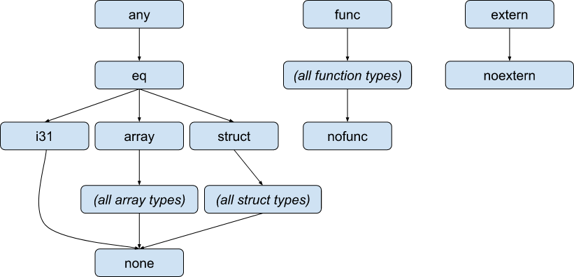
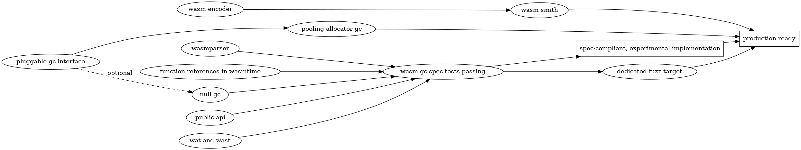

* [Summary](#summary)
* [Motivation](#motivation)
* [Proposal](#proposal)
  * [Implementing the Standard](#implement-the-standard)
  * [The Public API](#the-public-api)
    * [Types](#types)
    * [Values](#values)
    * [Limitations of the Public API](#limitations-of-the-public-api)
  * [Implementing `extern.externalize` and `extern.internalize`](#implementing-externexternalize-and-externinternalize)
  * [Defining the Pluggable GC Interface](#defining-the-pluggable-gc-interface)
    * [The `wasmtime_environ::GcCompiler` Trait](#the-wasmtime_environgccompiler-trait)
    * [The `wasmtime_runtime::GcRuntime` Trait](#the-wasmtime_runtimegcruntime-trait)
  * [GC Implementations](#gc-implementations)
    * [The Null GC](#the-null-gc)
    * [The Pooling Allocator-Integrated Collector](#the-pooling-allocator-integrated-collector)
  * [What about the existing deferred reference-counting collector?](#what-about-the-existing-deferred-reference-counting-collector)
  * [Fuzzing Wasm GC](#fuzzing-wasm-gc)
  * [Incremental Implementation Plan](#incremental-implementation-plan)
* [Rationale and Alternatives](#rationale-and-alternatives)
* [Open Questions](#open-questions)

# Summary
[summary]: #summary

<!-- **Use this template to seek consensus on a fleshed out proposal.** -->
<!-- One paragraph explanation of the proposal. -->

Implement support for [the WebAssembly garbage collection (GC)
proposal][wasm-gc-proposal] in Wasmtime. Allow plugging different collectors
into Wasmtime to support the requirements of different Wasmtime embeddings
running different Wasm workloads.

[wasm-gc-proposal]: https://github.com/WebAssembly/gc
[typed-func-refs-proposal]: https://github.com/WebAssembly/gc/blob/main/proposals/function-references/Overview.md

# Motivation
[motivation]: #motivation

<!-- Why are we doing this? What use cases does it support? What is the expected outcome? -->

The GC proposal will bring many new languages to Wasm. Current Wasm is not a
feasible target for these languages because they operate on collector-managed
objects, and would need to bundle a large runtime with the application code,
which leads to code bloat and inefficiency. The Wasm GC proposal addresses this
by building support for defining and allocating collector-managed objects into
WebAssembly. The proposal is currently in phase 3, is beginning to reach
maturity, and has in-progress implementations in V8 and SpiderMonkey. On the
toolchain side, there is active work on compiling Dart, Kotlin, Java, Scheme,
and OCaml to Wasm GC. I'm sure there are, or will soon be, many more toolchains
targeting Wasm GC that I'm unaware of.

Why support pluggable collectors? Wasmtime is used to run a variety of different
Wasm workloads from traditional long-running programs to extremely short-lived
function-as-a-service programs. A traditional program will, in the limit, demand
sophisticated features from its collector like a generational nursery,
concurrent mutation and collection, and compaction to reduce heap
fragmentation. A function-as-a-service environment will want to, on the other
hand, simply delay triggering garbage collection as long as it can, since the
program will probably terminate before garbage collection is truly necessary to
avoid running out of memory. It also requires detailed accounting of heap space
and allocations for tracking each guest's resource consumption, as well as tight
integration with Wasmtime's [pooling instance
allocator](https://docs.rs/wasmtime/latest/wasmtime/struct.PoolingAllocationConfig.html).

# Proposal
[proposal]: #proposal

<!-- The meat of the RFC. Explain the proposal in sufficient detail to support -->
<!-- building consensus around the primary design questions and how they affect -->
<!-- stakeholders. The fine details of a design will be finalized during -->
<!-- implementation review. -->

## Implementing the Standard

I expect that implementing everything in the Wasm GC proposal that is not the
garbage collector itself and the user-facing `wasmtime` crate's API will be
relatively straightforward. For the most part, implementation should follow from
the specification. Therefore, this proposal will focus on the designing the
public API to expose GC-managed objects and the collector interface and
implementations.

## The Public API

### Types

We will add a `Ref` variant of `wasmtime::ValType` that contains a
`wasmtime::RefType` and move all existing reference type variants from
`wasmtime::ValType` and into `wasmtime::RefType`:

```rust
pub enum ValType {
    I32,
    I64,
    F32,
    F64,
    V128,
    Ref(RefType),
}

pub struct RefType {
    nullable: bool,
    heap_type: HeapType,
}

pub enum HeapType {
    /// Common types that appear in every Wasm module's type hierarchy.
    Extern,
    NoExtern,
    Func,
    NoFunc,
    Any,
    Eq,
    I31,
    Array,
    Struct,
    None,

    /// A reference to an array, function, or struct type defined inside a
    /// particular module's type section.
    TypedArray(ArrayType),
    TypedFunction(FunctionType),
    TypedStruct(StructType),
}
```

This refactoring has already begun a bit in [the work-in-progress function
references proposal
implementation](https://github.com/bytecodealliance/wasmtime/pull/5288).

It is worth noting that we have a few options for exactly what
`{Array,Function,Struct}Type` should be:

1. They could essentially be a `(Module, u32)` pair, but this means that
   `ValType` can no longer be `Copy` and cloning it potentially has to do atomic
   reference counting operations inside `Module::clone`.

2. Similarly, they could be an `Arc<{Array,Function,Struct}TypeInner>`, and skip
   the original type index. This would still do the atomic reference counting
   operations on clone. However, this would have problems dealing with cyclic
   types, as Rust's `Arc` is not cycle collected.

3. Alternatively, it could be a new index type into some new type registry (in
   `wasmtime::Engine`, since it would need to be shared across modules) which we
   add and remove entries from as modules are loaded into the engine or
   dropped. This would allow `ValType` to remain `Copy` but it would mean that
   once the module that introduced a type is dropped from the registry due to
   dropping its module, any remaining `ValType`s that reference that type get
   "nullified" and you could no longer inspect the now-dropped type.

Because of the issues with cyclic data, and the fact that passing GC objects
between modules will need to canonicalize types across modules for type checking
anyways, this RFC proposes option (3). Therefore, these types' constructors and
accessors will have a `wasmtime::Engine` parameter:

```rust
pub struct ArrayType(u32);

impl ArrayType {
    pub fn new(engine: &Engine, element_type: FieldType) -> ArrayType { /* ... */ }

    pub fn element_type(&self, engine: &Engine) -> FieldType { /* ... */ }
}

pub struct FunctionType(u32);

impl FunctionType {
    pub fn new(
        engine: &Engine,
        params: impl IntoIterator<Item = ValType>,
        results: impl IntoIterator<Item = ValType>,
    ) -> FunctionType {
        // ...
    }

    pub fn params<'engine>(&self, engine: &'engine Engine) -> &'engine [ValType] { /* ... */ }

    pub fn results<'engine>(&self, engine: &'engine Engine) -> &'engine [ValType] { /* ... */ }
}

pub struct StructType(u32);

impl StructType {
    pub fn new(
        engine: &Engine,
        fields: impl IntoIterator<Item = FieldType>,
    ) -> StructType {
        // ...
    }

    pub fn fields<'engine>(&self, engine: &'engine Engine) -> &'engine [FieldType] { /* ... */ }
}

// (These types follow directly from the Wasm GC proposal, but are included for
// completeness since they are referenced above.)

pub enum PackedType {
    I8,
    I16,
}

pub enum StorageType {
    Packed(PackedType),
    Unpacked(ValType),
}

pub struct FieldType {
    pub mutable: bool,
    pub storage: StorageType,
}
```

Note that this proposed `FunctionType` will replace the existing
`wasmtime::FuncType` and will be an annoying (but mechanical) breaking API
change.[^breaking-api]

[^breaking-api]: In general, we can't avoid breaking changes to the public
    `wasmtime` crate's API while exposing GC references. At minimum we need to
    add new variants to `enum`s.

### Values

As for exposing reference values in the public API, we have three major goals,
which are somewhat in conflict:

1. Ergonomics
2. Performance
3. Safety

(3) is a hard requirement, at least for now. I think we need *something* working
that is 100% safe, and if we need to add unsafe APIs on the side to release
specific pressures (similar to `ValRaw`) then we can do that, but it would be a
colossal failure for us to lose our API's safe-by-default property and force
unsafety on all Wasmtime embedders.

Additionally, there are three disjoint type hierarchies in the Wasm GC proposal:

1. Internal data types
2. Function types
3. Extern types

These have the following super-->sub type relationships:



This RFC proposes creating a Rust type that mirrors each of the types that are
in every Wasm module, but not a Rust type for Wasm types that reference a type
that is defined in the module's type section.

With those goals in mind, here is the proposed API for exposing reference values
in the public API. Similar to `wasmtime::ValType::Ref`, we will add a new `Ref`
variant of `wasmtime::Val`, which itself is an `enum` over the three different
Wasm type hierarchies:

```rust
pub enum Val {
    // <existing variants>

    // Non-nullable references.
    Ref(Ref),
    // Nullable references.
    RefNull(Option<Ref>),
}

pub enum Ref {
    Internal(AnyRef),
    External(ExternRef),
    Function(Func),
}

impl From<AnyRef> for Ref { /* ... */ }
impl From<EqRef> for Ref { /* ... */ }
impl From<StructRef> for Ref { /* ... */ }
impl From<ArrayRef> for Ref { /* ... */ }
impl From<Option<ExternRef>> for Ref { /* ... */ }
impl From<ExternRef> for Ref { /* ... */ }
impl From<Option<Func>> for Ref { /* ... */ }
impl From<Func> for Ref { /* ... */ }

impl TryFrom<Ref> for AnyRef { /* ... */ }
impl TryFrom<Ref> for EqRef { /* ... */ }
impl TryFrom<Ref> for StructRef { /* ... */ }
impl TryFrom<Ref> for ArrayRef { /* ... */ }
impl TryFrom<Ref> for Option<ExternRef> { /* ... */ }
impl TryFrom<Ref> for ExternRef { /* ... */ }
impl TryFrom<Ref> for Option<Func> { /* ... */ }
impl TryFrom<Ref> for Func { /* ... */ }
```

Function references will continue to be represented by `wasmtime::Func` and
`wasmtime::TypedFunc`. External references will continue to be represented by
`wasmtime::ExternRef`.

The new `AnyRef` Rust type represents the Wasm super type for all internal
data. Below `any` is `eq` which is the super type for all Wasm types that can be
compared for equality, which are currently `i31`s, `struct`s, and `array`s. The
only things which are `any` but not `eq` are `extern`s that have been
"internalized". That is, while the `any` and `extern` type hierarchies are
distinct, you can wrap one up as the other via the `extern.internalize` and
`extern.externalize` instructions.

```rust
pub struct AnyRef {
    // ...
}

impl From<EqRef> for AnyRef { /* ... */ }

impl TryFrom<AnyRef> for EqRef { /* ... */ }

impl AnyRef {
    pub fn heap_type(&self) -> HeapType { /* ... */ }
    pub fn is_instance_of(&self, store: impl AsContext, ty: HeapType) -> bool { /* ... */ }

    pub fn is_eq_ref(&self) -> bool { */ ... */ }
    pub fn as_eq_ref(&self) -> Option<EqRef> { /* ... */ }
    pub fn into_eq_ref(self) -> Option<EqRef> { /* ... */ }

    pub fn externalize(self, store: impl AsContextMut) -> ExternRef { /* ... */ }
}

impl ExternRef {
    pub fn internalize(self, store: impl AsContextMut) -> AnyRef { /* ... */ }
}

pub struct EqRef {
    // ...
}

impl PartialEq for EqRef { /* ... */ }
impl Eq for EqRef { /* ... */ }

impl From<I31Ref> for EqRef { /* ... */ }
impl From<StructRef> for EqRef { /* ... */ }
impl From<ArrayRef> for EqRef { /* ... */ }

impl TryFrom<EqRef> for I31Ref { /* ... */ }
impl TryFrom<EqRef> for StructRef { /* ... */ }
impl TryFrom<EqRef> for ArrayRef { /* ... */ }

impl EqRef {
    pub fn heap_type(&self) -> HeapType { /* ... */ }
    pub fn is_instance_of(&self, store: impl AsContext, ty: HeapType) -> bool { /* ... */ }

    pub fn is_i31_ref(&self) -> bool { */ ... */ }
    pub fn as_i31_ref(&self) -> Option<I31Ref> { /* ... */ }
    pub fn into_i31_ref(self) -> Option<I31Ref> { /* ... */ }

    pub fn is_struct_ref(&self) -> bool { */ ... */ }
    pub fn as_struct_ref(&self) -> Option<StructRef> { /* ... */ }
    pub fn into_struct_ref(self) -> Option<StructRef> { /* ... */ }

    pub fn is_array_ref(&self) -> bool { */ ... */ }
    pub fn as_array_ref(&self) -> Option<ArrayRef> { /* ... */ }
    pub fn into_array_ref(self) -> Option<ArrayRef> { /* ... */ }
}
```

Note that the `into_*_ref` methods avoid reference counting operations. More one
this below.

`I31Ref` allows getting its inner 31-bit value as either a signed `i32` or
unsigned `u32` and creation from those types as well (optionally checking that
the value fits in 31 bits or else masking the value to 31 bits):

```rust
pub struct I31Ref {
    // ...
}

impl PartialEq for I31Ref { /* ... */ }
impl Eq for I31Ref { /* ... */ }

impl I31Ref {
    pub fn signed(x: i32) -> Option<I31Ref> { /* ... */ }
    pub fn unsigned(x: u32) -> Option<I31Ref> { /* ... */ }

    pub fn signed_masked(x: i32) -> I31Ref { /* ... */ }
    pub fn unsigned_masked(x: u32) -> I31Ref { /* ... */ }

    pub fn get_signed(&self) -> i32 { /* ... */ }
    pub fn get_unsigned(&self) -> u32 { /* ... */ }
}
```

The `StructRef` Rust type represents the Wasm super type for all `struct`s. It
allows getting and setting fields.

```rust
pub struct StructRef {
    // ...
}

impl PartialEq for StructRef { /* ... */ }
impl Eq for StructRef { /* ... */ }

impl StructRef {
    pub fn new(
        store: impl AsContextMut,
        ty: StructType,
        fields: impl Iterator<Item = Val>,
    ) -> Result<StructRef> {
        // ...
    }

    pub fn struct_type(&self) -> StructType { /* ... */ }
    pub fn is_instance_of(&self, store: impl AsContext, ty: StructType) -> bool { /* ... */ }

    pub fn get(&self, store: impl AsContextMut, field: u32) -> Result<Val> { /* ... */ }
    pub fn set(&self, store: impl AsContextMut, field: u32, value: Val) -> Result<()> { /* ... */ }
}
```

And the `ArrayRef` Rust type, representing the Wasm super type for all `array`s,
looks very similar to `StructRef` but additionally has a `len` method:

```rust
pub struct ArrayRef {
    // ...
}

impl PartialEq for ArrayRef { /* ... */ }
impl Eq for ArrayRef { /* ... */ }

impl ArrayRef {
    pub fn new(
        store: impl AsContextMut,
        ty: ArrayType,
        fill_value: Val,
    ) -> Result<ArrayRef> {
        // ...
    }

    pub fn new_default(store: impl AsContextMut, ty: ArrayType) -> Result<ArrayRef> {
        // ...
    }

    pub fn from_elements(
        store: impl AsContextMut,
        ty: ArrayType,
        elements: impl Iterator<Item = Val>,
    ) -> Result<ArrayRef> {
        // ...
    }

    pub fn array_type(&self) -> ArrayType { /* ... */ }
    pub fn is_instance_of(&self, store: impl AsContext, ty: ArrayType) -> bool { /* ... */ }

    pub fn len(&self, store: impl AsContext) -> u32 { /* ... */ }
    pub fn get(&self, store: impl AsContextMut, elem: u32) -> Result<Val> { /* ... */ }
    pub fn set(&self, store: impl AsContextMut, elem: u32, value: Val) -> Result<()> { /* ... */ }
}
```

Note that the `StructRef::{get,set}` and `ArrayRef::{get,set}` methods require
passing in a mutable `wasmtime::Store` context. This is because the GC objects
are only valid while the store is live and the whole GC heap may be deallocated,
reclaimed, or otherwise recycled for new instances once the store and its Wasm
instances are dropped. Therefore, these methods cannot simply dereference
pointers to their underlying objects, they need to assert that the given context
is the same store that their object came from, which means the referenced object
is still live, because `wasmtime::Ref`s always root their referent.

With regards to performance, the biggest concern is synchronization, since
stores can be sent between threads. We really want the minimum of
synchronization and we really don't want to force Wasm to internally synchronize
object accesses just because the public API has to. Therefore,
`wasmtime::{Struct,Array}Ref`s do not contain the actual pointers to the
GC-managed objects, instead they are essentially an index into a root set in the
`wasmtime::Store`. Each entry in the root set has (1) the raw GC pointer, and
(2) an atomic reference count keeping track of how many
`wasmtime::{Struct,Array}Ref`s are currently pointing to it. Cloning a
`wasmtime::{Struct,Array}Ref` bumps the count, while dropping it decrements the
count. This needs to be an atomic reference count because `wasmtime::Store` must
be `Send` to work with async. Altogether, this gives us the following desirable
properties:

* Updating pointers to GC objects (for moving GC) is easy. We don't need to
  figure out how to track `wasmtime::{Struct,Array}Ref`s on the stack (which is
  hard without move constructors) or elsewhere in the native heap.

* We do *not* need to protect every object field access with locks and atomics
  because the `wasmtime::{Struct,Array}Ref` accessors take a store argument and,
  because neither stores nor `wasmtime::{Struct,Array}Ref`s are `Sync`, that is
  proof that they are on the same thread.

However, even with this scheme to avoid synchronization, manipulating GC objects
from the host will be slower than from Wasm, since

* the host accesses objects through an indirection, while Wasm has raw GC object
  pointers,

* the host will be constantly rooting and unrooting GC objects as it traverses
  their fields and array elements while the Wasm instead has stack maps for
  identifying roots, and

* the host doesn't have static type information while the Wasm does.

But this okay because I expect that performance of Wasm accessing GC objects is
a much larger concern than that of the host accessing GC objects.

Similarly, the root set itself doesn't need a mutex because we only mutate it
(other than its entries' ref counts, which have atomically-synchronized internal
mutability) when we have mutable access to a store (e.g. when allocating new
entries or when collecting garbage). Finally, because
`wasmtime::{Struct,Array}Ref`s don't internally hold a mutable store, when they
decrement their associated root set entry's ref count and it reaches zero, they
cannot remove the zero-ref-count entry from the set. That is delayed until
either the next garbage collection or when the whole store is dropped.

Altogether, this design for exposing reference values in the public API allows
us to keep performance-degrading synchronization to a minimum while still
providing a fully safe and relatively ergonomic API and simultaneously keeping
Wasm manipulation of GC objects as fast as possible.

### Limitations of the Public API

Notably, this limited API is missing a few related things:

1. Unrooted GC references

2. A `GcTrace` trait to cooperate with the collector to find live objects

3. A "typed" version of the API that lets you define a Rust struct that can be
   exposed to Wasm as a GC'd object or convert a Wasm GC object to a Rust
   struct.

Supporting the third requires the first two and also we would need to translate
between Rust's object layout and however the GC backend decides to lay objects
out.

Supporting custom `GcTrace` implementations would also open the door to
use-after-free bugs when a struct gains a new GC-managed reference but forgets
to update the corresponding `GcTrace` implementation.

The lack of a `GcTrace` trait and an unrooted reference type in the public API
does, however, mean that any cycles between a host-created `externref`
containing a `wasmtime::{Struct,Array}Ref` that (transitively) holds onto that
`externref` will never be reclaimed. Because the `wasmtime::{Struct,Array}Ref`
is always rooted, it keeps everything it can reach alive until dropped, and
because there is a cycle it won't ever be dropped.

This RFC proposes that we do not initially support these features and not having
them is acceptable for the time being. If and when there is sufficient demand
and motivation, we can add a `GcTrace` trait and unrooted reference type
later. There will be more design work to be done, but it won't fundamentally
change any of the rest of this RFC's design.

## Implementing `extern.externalize` and `extern.internalize`

As mentioned earlier, these instructions bridge the distinct `any` and `extern`
type hierarchies, allowing wrapping an external reference into an internal
reference and vice versa. The following identities must hold:

```
my_extern == externalize(internalize(my_extern))
my_intern == internalize(externalize(my_intern))
```

This means that when internalizing, we need to check whether the referent is a
"regular" `externref` (in which case we need to wrap it) or a wrapped `anyref`
masquerading as an `externref` (in which case we need to unwrap it). When
externalizing we need to perform dual checks and operations.

We can initially implement these instructions as libcalls, performing this
wrapping and unwrapping in VM code. This way we can continue to use `dyn Any` to
represent an `externref`'s inner data, and use `std::any::Any::is` and friends
to check whether it is a wrapper around an internal reference or not. However,
wrapping an `externref` into an internal reference will require a "hidden" type
like `(struct (field externref))` that doesn't have an associated type section
index and is solely an implementation detail of wrapping and unwrapping.

In the fullness of time, we can emit inline code to implement these
instructions. This will require a second "hidden" type to represent `externref`
wrappers around an internal reference so that we don't rely on `dyn Any` which
requires manipulation from Rust code.

## Defining the Pluggable GC Interface

Plugging in different GC backends will require implementing two traits:

1. `wasmtime_environ::GcCompiler`

2. `wasmtime_runtime::GcRuntime`

These traits let the collector hook into the compiler and runtime respectively.

Note that these traits are not exposed from the main, user-facing `wasmtime`
crate. We do not intend for these traits to have the same stability guarantees
that the public `wasmtime` crate has. These traits are purely for internal
factoring and running experiments with new collectors. The `wasmtime` crate will
expose a small handful of built-in collectors to choose from; it won't let you
bring your own collector. This is similar to the approach taken by the
`wasmtime_runtime::InstanceAllocator` trait.

Note that the interface will fix some design decisions for GC implementations:

1. GC roots on the Wasm stack will always be precisely traced in a
   stop-the-world phase. We won't do conservative stack scanning, nor will we
   reference count Wasm-stack roots, nor will we incrementally trace stack
   roots.

2. GC roots held from Rust (either on the stack or some heap-allocated
   structure) will always be reference counted, as described above in the public
   API section.

In fact, the GC implementation will not interact with roots directly at all, it
will just be handed the root set at the start of a collection.

### The `wasmtime_environ::GcCompiler` Trait

The `GcCompiler` trait is used when compiling Wasm code. We will add a
`gc_compiler` method to `wasmtime_environ::FuncEnvironment` to get the
`GcCompiler` for the current function compilation:

```rust
trait FuncEnvironment {
    // <existing methods>

    type Gc: GcCompiler;
    fn gc_compiler(&mut self) -> &mut Self::Gc;
}
```

Fundamentally, the `GcCompiler` trait allows the collector to do three things:

1. Define the layout for GC objects.

2. Emit read and write barriers for struct field and array element accesses in
   Wasm code, if necessary.

3. Emit code sequences to get the type id of an object. We will use this when
   implementing dynamic checks for downcasting references.

I've sketched the trait and related types below, but I fully expect this to
change during implementation when faced with reality. I do not expect those
three bits of functionality to fundamentally change, however, even if we
completely change or remove `GcStructLayout`, for example.

```rust
/// The layout of a GC object.
pub enum GcObjectLayout {
    Struct(GcStructLayout),
    Array(GcArrayLayout),
}

/// The layout for a GC-managed struct type.
pub struct GcStructLayout {
    /// The size of this struct.
    pub size: u32,
    /// The alignment of this struct.
    pub align: u32,
    /// The fields of this struct. Each entry is the field's offset in the
    /// struct and its type.
    pub fields: Vec<(u32, wasm_types::WasmType)>,
}

/// The layout for a GC-managed array type.
pub struct GcArrayLayout {
    /// The alignment of this array and its header. Must be at least 4 bytes
    /// so that the `len: u32` field can be aligned, but may need to be
    /// larger if the GC requires that or if the element type requires it.
    pub align: u32,
    /// The size of the array header. Must be at least 4 bytes, as it must
    /// contain a `len: u32` field indicating how many array elements follow
    /// inline after this object.
    pub header_size: u32,
    /// The offset of the `len: u32` field. Must be aligned to 4 bytes.
    pub len_field: u32,
    /// The type of this array's elements.
    pub element_type: wasm_types::WasmType,
}

/// A trait for the collector to hook into compilation, emitting any
/// read/write barriers it requires.
pub trait GcCompiler {
    /// Define the object layouts for the types in a recursion group.
    ///
    /// Because the collector determines object layout, it can insert any
    /// object headers it requires.
    fn rec_group_layouts(&mut self, sub_types: &[wasm_types::SubType]) -> Vec<GcObjectLayout>;

    /// Return the CLIF type for GC references with this collector. Must be
    /// either `r32` or `r64`.
    fn reference_type(&mut self, isa: &dyn TargetIsa) -> ir::types::Type;

    /// The function builder type for this compiler (that is,
    /// `cranelift_frontend::FunctionBuilder` or the Winch equivalent).
    type FunctionBuilder;

    /// Emit code to get the precise type id of the given object.
    ///
    /// Parameters:
    ///
    /// * `builder`: A function builder, allowing implementors to insert
    ///   instructions and basic blocks.
    ///
    /// * `object`: A value of type `GcCompiler::reference_type`, pointing to
    ///   the object in question.
    ///
    /// * `object_type`: The statically-known super type of the object.
    ///
    /// Result:
    ///
    /// * The type id of the object, as an `i32` value.
    fn type_id(
        builder: &mut Self::FunctionBuilder,
        object: ir::Value,
        object_type: &wasm_types::WasmRefType,
    ) -> ir::Value;

    /// Emit code for `receiver.field = value`.
    ///
    /// This is an opportunity to implement any write barriers in Wasm code,
    /// if necessary.
    ///
    /// Parameters:
    ///
    /// * `builder`: A function builder, allowing implementors to insert
    ///   instructions and basic blocks.
    ///
    /// * `receiver`: A value of type `GcCompiler::reference_type`, pointing
    ///   to the receiver.
    ///
    /// * `receiver_layout`: The layout for the receiver's type, as
    ///   previously defined by `GcCompiler::rec_group_layouts`.
    ///
    /// * `field`: The index of the field being written to (note that this
    ///   is *not* the field's offset, that can be obtained via
    ///   `receiver_layout.fields[field]`).
    ///
    /// * `value`: The value being written to the given field.
    fn write_struct(
        &mut self,
        builder: &mut Self::FunctionBuilder,
        receiver: ir::Value,
        receiver_layout: &GcStructLayout,
        field: u32,
        value: ir::Value,
    );

    /// Emit code for reading `receiver.field`.
    ///
    /// This is an opportunity to implement any read barriers in Wasm code,
    /// if necessary.
    ///
    /// Parameters:
    ///
    /// * `builder`: A function builder, allowing implementors to insert
    ///   instructions and basic blocks.
    ///
    /// * `receiver`: A value of type `GcCompiler::reference_type`, pointing
    ///   to the receiver.
    ///
    /// * `receiver_layout`: The layout for the receiver's type, as
    ///   previously defined by `GcCompiler::rec_group_layouts`.
    ///
    /// * `field`: The index of the field being written to (note that this
    ///   is *not* the field's offset, that can be obtained via
    ///   `receiver_layout.fields[field]`).
    ///
    /// Result:
    ///
    /// * The value read from the given field.
    fn read_struct(
        &mut self,
        builder: &mut Self::FunctionBuilder,
        receiver: ir::Value,
        receiver_layout: &GcStructLayout,
        field: u32,
    ) -> ir::Value;

    /// Emit code for writing `array[index] = value`.
    ///
    /// This is an opportunity to implement any write barriers in Wasm code,
    /// if necessary.
    ///
    /// Parameters:
    ///
    /// * `builder`: a function builder, allowing implementors to insert
    ///   instructions and basic blocks.
    ///
    /// * `array`: a value of type `GcCompiler::reference_type`, pointing to
    ///   the array.
    ///
    /// * `array_layout`: The layout for the array's type, as previously
    ///   defined by `GcCompiler::rec_group_layouts`.
    ///
    /// * `index`: The index being written to (note that this is *not* the
    ///   element's offset, that can be obtained via
    ///   `array_layout.header_size + index * sizeof(element)`).
    ///
    /// * `value`: The value being written to the given index.
    fn write_array(
        &mut self,
        builder: &mut Self::FunctionBuilder,
        array: ir::Value,
        array_layout: &GcArrayLayout,
        index: ir::Value,
        value: ir::Value,
    );

    /// Emit code for reading `array[index]`.
    ///
    /// This is an opportunity to implement any read barriers in Wasm code,
    /// if necessary.
    ///
    /// Parameters:
    ///
    /// * `builder`: A function builder, allowing implementors to insert
    ///   instructions and basic blocks.
    ///
    /// * `array`: A value of type `GcCompiler::reference_type`, pointing to
    ///   the array.
    ///
    /// * `array_layout`: The layout for the array's type, as previously
    ///   defined by `GcCompiler::rec_group_layouts`.
    ///
    /// * `index`: The index being written to (note that this is *not* the
    ///   element's offset, that can be obtained via
    ///   `array_layout.header_size + index * sizeof(element)`).
    ///
    /// Result:
    ///
    /// * The value read from the array.
    fn read_array(
        &mut self,
        builder: &mut Self::FunctionBuilder,
        array: ir::Value,
        array_layout: &GcArrayLayout,
        index: ir::Value,
    ) -> ir::Value;
}
```

Note that, for now, the `GcCompiler` trait does not have a hook to customize
allocation. For now, we will always call out into VM code via a libcall that
will use the collector's corresponding `GcRuntime` trait implementation to
allocate objects. It should be relatively straightforward to add a
`GcCompiler::allocate` method in the future, but it will take some design work
to determine how to best allow the `GcCompiler` to emit a libcall for the
allocation slow path if the fast path is unavailable and it needs to fall
back. This would be strictly additive, without changing any of the proposed
design in this RFC, and so I've deferred it for now.

### The `wasmtime_runtime::GcRuntime` Trait

The `GcRuntime` trait is how Wasmtime uses the collector to manage GC objects at
runtime. It looks very similar to `GcCompiler`, except that instead of emitting
code to perform various operations, it just performs the operations directly. It
provides a few fundamental pieces of functionality:

1. Performing garbage collections. (Optionally in an async manner, where the
   collector yields every X duration, to avoid blocking other work in a
   concurrent system.)

2. Allocating new GC-managed objects.

3. Implementing read and write barriers for objects manipulated by native code
   (from either the Wasmtime public API or VM code).

4. Getting the type id of an object at runtime.

Again, the details are certainly up for grabs here, but I expect whatever
version of the `GcRuntime` trait we end up actually building to support those
bits of fundamental functionality.

The other key design choice is that the collector is given the GC heap on every
method call. This is critical for tight pooling-allocator integration (more on
that in a later section).

```rust
/// The bounds of a GC heap memory reservation for a Wasm instance.
pub struct GcHeap {
    pub ptr: NonNull<u8>,
    pub len: usize,
}

/// The set of roots for a garbage collection.
///
/// Intentionally left blank, but will have methods for iteration and updating
/// pointers to moved objects.
pub struct RootSet {
    // ...
}

/// Metadata about a `GcRuntime` instance.
pub struct GcMetadata {
    /// Does the GC require write barriers? If not, we can avoid virtual calls
    /// in `wasmtime::StructRef::set`, for example.
    pub needs_write_barriers: bool,
    /// Does the GC require read barriers?
    pub needs_read_barriers: bool,
}

pub trait GcRuntime {
    /// Get this collector's metadata.
    fn metadata(&self) -> GcMetadata;

    /// Perform a garbage collection on the given heap.
    ///
    /// Parameters:
    ///
    /// * `heap`: The heap to perform garbage collection on.
    ///
    /// * `roots`: The set of GC roots.
    unsafe fn gc(&self, heap: GcHeap, roots: RootSet);

    /// Like `GcRuntime::gc` but asynchronous.
    ///
    /// The mutator will not run during yields.
    unsafe fn async_gc(
        &self,
        heap: GcHeap,
        roots: RootSet,
        yield_every: std::time::Duration,
    ) -> Box<dyn Future<Output = ()>>;

    /// Allocate a new object.
    ///
    /// Parameters:
    ///
    /// * `heap`: The heap to allocate the object within.
    ///
    /// * `layout`: The layout for the object to be allocated.
    ///
    /// * `type_id`: The type id for the object to be allocated.
    ///
    /// Result:
    ///
    /// * A pointer to the allocated object, or `None` if there isn't enough
    ///   heap space currently available.
    unsafe fn allocate(
        &self,
        heap: GcHeap,
        layout: &wasmtime_environ::GcObjectLayout,
        type_id: u32,
    ) -> Option<NonNull<u8>>;

    /// Get the precise type id for the given object.
    ///
    /// Parameters:
    ///
    /// * `heap`: The heap to allocate the object within.
    ///
    /// * `object`: A pointer to the object whose type id we want.
    ///
    /// * `layout`: The layout of a statically-known super type of the
    ///   object.
    ///
    /// Result:
    ///
    /// * The type id of the given object.
    unsafe fn type_id(
        &self,
        heap: GcHeap,
        object: NonNull<u8>,
        layout: &wasmtime_environ::GcObjectLayout,
    ) -> u32;

    /// Write barrier for struct fields: `receiver.field = value`.
    ///
    /// This is only called when `GcMetadata::needs_write_barriers == true`,
    /// otherwise Wasmtime will just do a raw write inline.
    ///
    /// Parameters:
    ///
    /// * `heap`: The heap that the object is within.
    ///
    /// * `recever_layout`: The layout of the receiver.
    ///
    /// * `receiver`: A pointer to the receiver struct.
    ///
    /// * `field`: The field being written to. (Note that `field` is *not*
    ///   the offset of the field, but an index of the `i`th field of the
    ///   object. The offset can be obtained via
    ///   `receiver_layout.fields[field].0`.)
    ///
    /// * `value`: The value being written into the field.
    unsafe fn write_struct(
        &self,
        heap: GcHeap,
        receiver_layout: &wasmtime_environ::GcObjectLayout,
        receiver: NonNull<u8>,
        field: u32,
        value: ValRaw,
    );

    /// Read barrier for struct elements: `receiver.element`.
    ///
    /// This is only called when `GcMetadata::needs_read_barriers == true`,
    /// otherwise Wasmtime will just do a raw read inline.
    ///
    /// Parameters:
    ///
    /// * `heap`: The heap that the object is within.
    ///
    /// * `recever_layout`: The layout of the receiver.
    ///
    /// * `receiver`: A pointer to the receiver struct.
    ///
    /// * `element`: The element being read from. (Note that `element` is *not*
    ///   the offset of the element, but an index of the `i`th element of the
    ///   object. The offset can be obtained via
    ///   `receiver_layout.elements[element].0`.)
    ///
    /// Result:
    ///
    /// * The value read from the element.
    fn read_struct(
        &self,
        heap: GcHeap,
        receiver_layout: &wasmtime_environ::GcStructLayout,
        receiver: NonNull<u8>,
        element: u32,
    ) -> ValRaw;

    /// Write barrier for array elements: `array[index] = value`.
    ///
    /// This is only called when `GcMetadata::needs_write_barriers == true`,
    /// otherwise Wasmtime will just do a raw write inline.
    ///
    /// Parameters:
    ///
    /// * `heap`: The heap that the array is within.
    ///
    /// * `recever_layout`: The layout of the array.
    ///
    /// * `array`: A pointer to the array.
    ///
    /// * `index`: The index being written to (note that this is *not* the
    ///   element's offset, that can be obtained via
    ///   `array_layout.header_size + index * sizeof(element)`).
    ///
    /// * `value`: The value being written into the element.
    unsafe fn write_array(
        &self,
        heap: GcHeap,
        array_layout: &wasmtime_environ::GcObjectLayout,
        array: NonNull<u8>,
        element: u32,
        value: ValRaw,
    );

    /// Read barrier for array elements: `array[index]`.
    ///
    /// This is only called when `GcMetadata::needs_read_barriers == true`,
    /// otherwise Wasmtime will just do a raw read inline.
    ///
    /// Parameters:
    ///
    /// * `heap`: The heap that the array is within.
    ///
    /// * `recever_layout`: The layout of the array.
    ///
    /// * `array`: A pointer to the array.
    ///
    /// * `index`: The index being read from. (Note that `index` is *not*
    ///   the offset of the index, but an index of the `i`th index of the
    ///   object. The offset can be obtained via
    ///   `array_layout.indexs[index].0`.)
    ///
    /// Result:
    ///
    /// * The value read from the index.
    fn read_array(
        &self,
        heap: GcHeap,
        array_layout: &wasmtime_environ::GcArrayLayout,
        array: NonNull<u8>,
        index: u32,
    ) -> ValRaw;
}
```

It isn't 100% clear to me that we want the whole
`GcMetadata::need_{read,write}_barriers` mechanism. It is a space-time trade
off: bloating `StructRef` and `ArrayRef` with a cached copy of those `bool`s to
avoid a virtual call. Inside `wasmtime::StructRef::get` would be something like
this:

```rust
if !self.cached_need_read_barriers {
    do_raw_read_inline();
} else {
    do_virtual_call_barrier();
}
```

This is making the assumption that the well-predicted branch with an inline read
is faster than a well-predicted virtual call with an out-of-line read. The
scheme also imposes a little bit of extra complexity that isn't strictly
functionally necessary. So I'm on the fence about it, we could easily remove it
and always do the virtual call. Or we could start with always doing the virtual
call and add this scheme later if performance becomes a concern.

## GC Implementations

We will have two GC implementations:

1. The null GC, which allocates until it runs out of heap space, at which
   point it triggers a trap in the guest.

2. A collector designed for tight-integration with our pooling allocator and its
   particular requirements.

Each collector will have a Cargo feature to enable or disable its availability
at compile time, so that `wasmtime` crate users don't have to pay for things
they won't use in terms of compile time.

In the future, if there is demand for a general-purpose collector with a
nursery, compaction, and all that, we can consider adding a third collector. The
`GcRuntime` and `GcCompiler` traits should ensure that doing so will require
minimal changes to the rest of Wasmtime. At that time we can evaluate whether we
want to use an off-the-shelf library like MMTK or develop our own.

### The Null GC

The null GC does not collect garbage. It allocates objects while it has
available heap space and `trap`s once it space runs out. Its implementation
should be very straightforward and this should be enough to get the Wasm GC spec
tests passing. It can also be useful for differentially measuring the overhead
imposed by various other GC implementations, and can serve as a "speed of light"
limit on how fast any GC implementation could ultimately be.

Note that while the null GC is "leaking" memory across a particular Wasm
instance's lifetime, it should not leaking memory across the whole OS process's
lifetime. When the instance's store is dropped, we will drop the null GC's heap
along with it.

### The Pooling Allocator-Integrated Collector

The pooling allocator is designed and optimized for multi-tenant
function-as-a-service workloads where instances are frequently and concurrently
allocated, have relatively short execution times, and then are deallocated. The
pooling allocator allocates all space for linear memories and tables up front,
and does not need to call `malloc` or perform additional virtual memory-related
syscalls when memories and tables grow. It allows for easy and precise
accounting of all of the memory used by an instance. With that in mind, we need
a collector that integrates with the pooling allocator while maintaining these
requirements:

* The pooling allocator can pre-allocate memory for the whole GC heap and give
  it to the collector to manage. The collector does not allocate or `mmap` its
  own heap.

* The collector uses the given memory reservation for *all* bookkeeping data
  (e.g. free lists and mark bits) and does not `malloc` additional space for
  metadata outside the given memory reservation.

* The collector should ideally have minimal heap overhead. That is, it should
  maximize the number and total size of objects that fit within its given memory
  reservation, and minimize the size of its bookkeeping metadata. This is,
  however, less important than the requirement that its metadata be allocated
  within the given memory reservation, and we can be flexible if need be.

* Allocation should be fast (ideally bump allocation).

* Collection itself does not have to be fast or incremental, because it should
  be very rare, given the short lifetime of instances. That said, we do need to
  be able to collect garbage (i.e. the null GC is inappropriate here) because we
  would rather take a GC pause than outright kill the instance when given the
  choice.

* Similarly, we do not need a compacting collector because instances don't live
  long enough for fragmentation to become a problem in practice.

* The collector should not make any virtual memory-related syscalls. [These
  syscalls take highly-contended locks in the kernel and trigger
  performance-destroying
  IPIs.](https://github.com/bytecodealliance/wasmtime/issues/4637) We go to
  great lengths to avoid these syscalls when we can in the pooling allocator,
  and the collector shouldn't re-introduce them.

* Running many independent instances of the collector concurrently in the same
  process should work correctly (i.e. the collector cannot assume it that is the
  only collector and it owns the whole process's memory) and it should
  transparently scale horizontally (i.e. there should be no global state shared
  across all collector instances that can become contended).

* The collector should be single-threaded. We take advantage of concurrency and
  parallelism a layer above each individual instance's execution in systems
  using the pooling allocator.

The simplest way to satisfy these requirements is by implementing our own
[semi-space copying
collector](https://en.wikipedia.org/wiki/Cheney%27s_algorithm) while keeping
them in mind. This collector requires minimal bookkeeping metadata that is
trivial to confine within the given memory reservation and provides fast bump
allocation. Its weakness is its heap overhead: it can only utilize half of its
given memory reservation for GC objects and the other half needs to be available
for copying live GC objects into when a collection is triggered.

A non-compacting mark-region collector (like a much-simplified version of
[Immix](https://dl.acm.org/doi/pdf/10.1145/1379022.1375586)) is tempting: it
could give us similarly fast allocation but with better heap utilization than a
semi-space copying collector. However, confining free lists and mark bits within
the pre-allocated memory reservation, while possible, would be a very much
larger engineering task.

It is tempting to reach for an off-the-shelf GC library but our above
requirements are very specific and it is unlikely we will be able to use an
off-the-shelf library for our needs without a lot of trouble and impedance
mismatch.

## What about the existing deferred reference-counting collector?

We implemented deferred reference counting (without cycle collection) for our
existing `externref` support. Moving forward we have two options:

1. Keep the deferred reference-counting collector and manage `externref`s
   completely separately from `anyref` and its subtypes.
2. Manage `externref`s with the same collector as `anyref` and its subtypes.
   1. And port the deferred reference-counting collector to the proposed GC
      interface (and, presumably, also grow a cycle collector) and manage both
      `externref`s and `anyref`s with it.
   2. Remove the deferred reference-counting collector in favor of the other GC
      backends.

A perhaps-nonobvious implication of option (1) is that cycles between
`externref`s and `anyref`s will always leak. The `externref` would be rooted in
the `externref`-heap because it is referenced by an `anyref` and the `anyref`
would be rooted in the `anyref`-heap because it is referenced by that
`externref`. But nothing else is referencing either of them, so the cycle is
garbage, but we cannot collect it. Collecting it requires identifying the cycle,
which requires a collector that sees both `externref`s and `anyref`s. And
because internal data can be "externalized" via the `extern.externalize`
instruction, it is trivial for Wasm guests to create such cycles. So (1) is not
a practical option.

In addition to the above issue with cycles, to pay down tech debt and ultimately
end up with the fewest moving parts, we should choose some variation of
(2). This RFC proposes (2.ii). Due to the pooling allocator's requirements we
have to implement a GC that specifically fits its requirements either way, and
ideally we wouldn't also maintain another, random collector that doesn't have
obvious motivation for existing. Again, we end up with fewer moving parts this
way, and the all the moving parts we do have are well-motivated.

Note that managing `externref`s with the same collector as `anyref`s does mean
that accessing a `wasmtime::ExternRef`'s inner data will require passing in a
store. It doesn't today, which means this will be another small breaking change
to the public API.

## Fuzzing Wasm GC

There are two main things I'd like to fuzz:

1. Our handling of different Wasm type definitions and checking subtyping
   between them.

2. How the collector itself handles mutations to the heap graph.

The type definition half of (1) can be handled by adding Wasm GC support to
`wasm-smith`, and given enough time the other half can be handled by it as
well. We might want to augment `wasm-smith` with a little purpose-built fuzz
target to generate Wasm types and check their subtyping relationships, but my
gut feeling is that this isn't critical.

Given infinite time `wasm-smith` will also exercise (2) but given how critical
the collector's correctness is to overall safety, we should have a dedicated
fuzz target specifically for exercising heap graph mutations. Whether we build a
new, from-scratch fuzz target or update our existing `table_ops` fuzz target
that exercises `externref` GC and write barriers is an open question. Either
way, we will want the fuzz target to:

1. Allocate new objects
2. Read fields/elements of those objects
3. Write to fields/elements of those objects
4. Make objects unreachable and allow the GC to reclaim them (should fall out
   from (3))
5. Change the shape of the heap graph (should also fall out from (3))
6. Trigger garbage collections (should fall out from (1) but we may want to
   explicitly trigger them as well)
7. Store and load objects into and from globals and tables
8. Receive objects as return values from calls
9. Pass objects to calls as arguments
10. Upcast and downcast references and then store them in other
    objects/tables/globals/etc.

And anything else you can do with an object that I am forgetting, at the moment.

## Incremental Implementation Plan

This is the dependency graph of everything that's required to implement Wasm GC
in Wasmtime. Round nodes are coarse-grained work items and rectangular nodes are
milestones.



To get a spec-compliant, but experimental, implementation in Wasmtime we need:

* [ ] To [finish implementing the function references
  proposal](https://github.com/bytecodealliance/wasmtime/pull/5288), as Wasm GC
  builds on top of it.
* [ ] Implement support for parsing and validating Wasm GC in `wasmparser`.
* [X] Implement support for Wasm GC in `wat` and `wast`. (Note: this is already
      done!)
* [ ] Implement an initial version of the null GC. We can either block on the
      full pluggable GC interface, which would allow us to build the final
      version of the null GC, or we can just hard-code the null GC as the only
      GC implementation available for this milestone. The latter would allow us
      to reach the milestone faster, but we would have to go back and fix up
      this code when we actually implement the pluggable GC interface.
* [ ] Implement Wasmtime's public API. This is necessary for getting the spec
      test suite running.
* [ ] Actually get the spec tests passing in Wasmtime and everything that
      entails: compilation, runtime support, etc.

From there, to get a production-ready implementation we will need:

* [ ] Wasm GC support in `wasm-encoder`
* [ ] Wasm GC support in `wasm-smith`
* [ ] The dedicated fuzzer for exercising Wasm GC
* [ ] The pluggable GC interface
* [ ] The semi-space copying collector with tight pooling-allocator integration

# Rationale and Alternatives
[rationale-and-alternatives]: #rationale-and-alternatives

<!-- What other designs have been considered and what is the rationale for chosing -->
<!-- the one proposed? -->

* We could make all of Wasmtime's public API managed by a global GC. That lets
  us avoid questions about cyclic type definitions and the lifetimes of
  canonicalized types in the registry in the engine and what happens when you
  try to get info about a type from a module that has since been
  dropped. However, this is a much bigger change to the public API, forces GC on
  all Wasmtime embedders even if they don't want the Wasm GC proposal, and
  requires a multi-threaded GC (which this proposal does not). The benefits do
  not outweight the drawbacks.

* Instead of focusing on a 100% safe, "dynamic" public API, we could focus on
  getting a "typed" API working. By analogy, we have `wasmtime::Func` and
  `wasmtime::TypedFunc<...>`, but this proposal is focused only on the former
  version of exposing GC-managed objects in the public API. I think these two
  paths are largely orthogonal, but we only have so many engineers to throw at
  this problem, so I think we have to sequence them. Of the two paths, I think
  first implementing the "dynamic" version that works for all types we could be
  given at runtime is the best choice.

* Instead of defining a pluggable GC interface, we could just choose a single
  implementation and try and make it general-purpose enough to work for all
  workloads and fit tightly within the pooling allocator's constraints. Doing
  both at the same time seems like an exceedingly hard engineering problem.

* We could start with implementing a general-purpose GC (either our own, as
  considered in the previous bullet point, or with an off-the-shelf library like
  MMTK). But either way we need to additionally implement a collector that
  tightly integrates with the pooling allocator, and no stakeholder has been
  clamoring for a general-purpose collector right now, so we might as well slim
  down our initial work plans for now. This lets us avoid effectively
  unauditable dependencies, at least for the time being. Note that it should
  still be easy to add in the future, should we want to, since the design of the
  pluggable GC API separates the collector from the rest of the runtime and
  prevents entangling the runtime with any particular single collector.

# Open Questions
[open-questions]: #open-questions

<!-- - What parts of the design do you expect to resolve through the RFC process -->
<!--   before this gets merged? -->
<!-- - What parts of the design do you expect to resolve through implementation after -->
<!--   the RFC is accepted? -->

* When attempting to access information about an array, struct, or function type
  whose sole defining module has been dropped, should we

  * panic, or

  * return `None` (meaning that all these type accessors return `Option`s)

  ?

* What exactly should `GcObjectLayout` and friends look like? Should they carry
  type information in addition to field offsets (which is sort of what it is
  sketched out above like) or should these two things be separate and we pass
  both in to anything that happens to need both. Not clear to me, I expect it
  won't be clear until we actually start writing code.

* Should we do the whole `GcMetadata::needs_{read,write}_barriers` thing? We can
  always not do it now and add it later.

* Should we build a new, from-scratch fuzz target for heap mutations or update
  our existing `table_ops` fuzz target that exercises `externref` write
  barriers?
