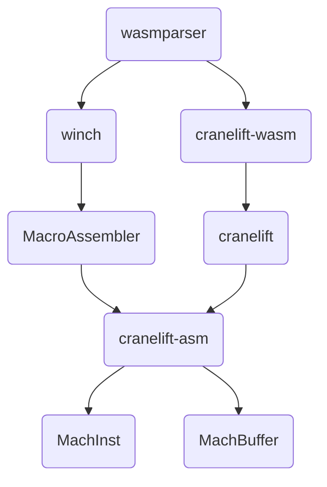

# Baseline Compilation in Wasmtime

Authors: Saúl Cabrera (@saulecabrera); Chris Fallin (@cfallin)

## Summary

This RFC proposes the addition of a new WebAssembly (Wasm) compiler to Wasmtime:
a single-pass or “baseline” compiler. A baseline compiler works to improve
overall compilation performance, yielding faster startup times, at the cost of
less optimized code.


## Motivation

Wasmtime currently uses Cranelift by default, which is an optimizing compiler.
Cranelift performs code optimizations at the expense of slower compilation
times. This makes Just-In-Time (JIT) compilation of Wasm unsuitable for cases
where higher compilation performance is desired (e.g. short-lived trivial
programs, cases in which startup time is more critical than runtime
performance). 

The introduction of a baseline compiler is a first step towards: (i) faster
compilation and startup times (ii) enabling a tiered compilation model in
Wasmtime, similar to what is present in Wasm engines in Web browsers. This RFC
**does not** account for tiered compilation, it only accounts for the
introduction of a baseline compiler.

**Approximate** [measurements](https://github.com/Shopify/wasm-bench) taken on
top of a subset of the [Sightglass benchmark
suite](https://github.com/bytecodealliance/sightglass/tree/main/benchmarks)
– using different optimizing and baseline compilers (Cranelift from Wasmtime,
Liftoff from V8 and RabaldrMonkey from SpiderMonkey) – show that a baseline
compiler on average yields 15x to 20x faster compilation while producing code
that is on average 1.1x to 1.5x slower than the one produced by an optimizing
compiler. These measurements align on average with other measurements observed
when comparing interpretation and compilation for WebAssembly[^1].


[^1]: Ben L. Titzer. [A fast in-place interpreter for
  WebAssembly](https://arxiv.org/pdf/2205.01183.pdf)

## Proposal: Winch, a baseline compiler for Wasmtime

Winch: WebAssembly Intentionally-Non-Optimizing Compiler and Host


### Design Principles

* Single pass over Wasm bytecode
* Function as the unit of compilation
* Machine code generation directly from Wasm bytecode – no intermediate
  representation
* Avoid reinventing machine-code emission – use Cranelift's instruction emitter
  code to create an assembler library ("MacroAssembler")
* Prioritize compilation performance over runtime performance

### High-level overview



### MacroAssembler and Borrowing from Cranelift

We plan to factor out the lower layers of Cranelift that produce and operate on
machine code in order to reuse them as a generic assembler library
(“MacroAssembler”).

The two key abstractions that will be useful to reuse are the `MachInst`
(“machine instruction”) trait and its implementations for each architecture; and
the `MachBuffer`, which is a machine-code emission buffer with some knowledge of
branches and ability to do peephole optimizations on them. The former lets us
reuse all the logic to encode instructions for an ISA; the latter lets us emit
code with “labels” and references to labels, and have the fixups done for us.

The `MachInst` trait and its implementations, and the `MachBuffer`, can be
mostly factored out into a separate crate `cranelift_asm`. This will require
some care with respect to layering: in particular, definitions of
machine-instruction types are currently done in the ISLE backends for each ISA
within Cranelift. We can continue to use ISLE for these, but they will need to
be moved to the separate crate.


As a result of this initial layering, one will be able to build a `MachInst` as
a Rust data structure and emit it manually, for example:

```rust
let add = cranelift_asm::x64::AluRmiR { op: AluRmiR::Add, … };
let mut buf = MachBuffer::new();
add.emit(&mut buf, …);
```

However this is still quite cumbersome. As a next step, we will develop an API
over this that provides for procedural generation of instructions: i.e., one
method call for each instruction. Something like:

```rust
let mut masm = cranelift_asm::x64::MacroAssembler::new(); 
masm.add(rd, rm);
masm.store(rd, MemArg::base_offset(ra, 64));
``` 
This would allow for
fairly natural single-pass code emission. In essence, this is an implementation
of the [MacroAssembler
idea](https://searchfox.org/mozilla-central/rev/fa71140041c5401b80a11f099cc0cd0653295e2c/js/src/jit/MacroAssembler.h)
from SpiderMonkey. Each architecture will have an implementation of the
MacroAssembler API; perhaps there can be a trait that abstracts commonalities,
but enough will be different (e.g., instruction set quirks beyond the usual
“add/sub/and/or/not” suspects, x64 two-operand form vs aarch64 three-operand
form, and more) that we expect there to be different `MacroAssembler` types for
each ISA. This in turn implies different lowering code that invokes the
`MacroAssembler` per ISA in the baseline compiler. The lowering code can perhaps
share many helpers that are monomorphized on the “common ISA core” trait.

In the above examples, we bypass the register-allocation support, i.e. the
ability to hold virtual register operands rather than real registers, in the
`MachInst`s. This is supported today by passing through `RealReg`s (“real
registers”) instead. In the baseline compiler we expect register allocation to
occur before invoking the `MacroAssembler`; i.e., when generating the
instructions we already know which register we are using for each operand. Doing
otherwise (emitting with vregs first and editing later) requires actually
buffering the `MachInst` structs in memory, which we do not wish to do.

We don’t expect to make any changes to Cranelift itself beyond the layering
refactor to borrow its `MachInst` and `MachBuffer` implementations. In
particular we don’t expect to use the `MacroAssembler` wrapper in Cranelift, at
least at first, because it will be built around constructing and emitting
instructions to machine code right away, without buffering (as in Cranelift’s
VCode). It’s possible in the future that we may find other ways to make
`MacroAssembler` generic and leverage it in Cranelift too, but that is beyond
the scope of this RFC.

### Register Allocation

We plan to implement register allocation in a single-pass fashion.

The baseline compiler will hold a reference to a register allocator abstraction,
which will keep a list of registers, represented by Cranelit's `Reg`
abstraction, per ISA, along with their availability. It will also hold
a reference to a value stack abstraction, to keep track of operands and results
and their location as it performs compilation. These are the two key
abstractions for register allocation:

```rust
pub struct Compiler {
  //...
  allocator: RegisterAllocator,
  value_stack: ValueStack,
  //...
}
```

The value stack is expected to keep track of the location of its values.
A particular value can be tagged as either a:

* Local: representing a function local slot (index and type). The address of the
  local will be resolved lazily to reduce register pressure. 
* Register
* Constant: representing an immediate value. 
* Memory Offset: the location of the value at a given memory offset

Registers will be requested to the register allocator every time an operation
requires it. If no registers are available, the baseline compiler will move
all locals and all registers to memory, changing their tag to a memory offset,
performing what's known as spilling, effectively freeing up registers. Spilling
will also be performed at control flow points. To reduce the number of spills,
the baseline compiler will also perform limited constant rematerialization.

Assuming that we have an immediate at the top of the stack, emitting an add
instruction with an immediate operand would look something like this:

```rust
let mut masm = cranelift_asm::x64::MacroAssembler::new();
let imm = self.value_stack.pop(); 
// request a general purpose register;
// spill if none available
let rd = self.gpr();
masm.add(rd, imm);
```

### Integration with Wasmtime

We plan to integrate the baseline compiler incrementally into Wasmtime, as an
in-tree crate, `winch`. It will be introduced as a compile-time feature, off by
default. Taking as a guideline [Wasmtime's tiers of
support](https://github.com/bytecodealliance/wasmtime/pull/4479), this means
that the baseline compiler will be introduced as a Tier 3 feature.

In general, the development of the baseline compiler will be done in phases,
each phase covering a specific set of features:

| Phase | Feature                  | Feature Type        |
|-------|--------------------------|---------------------|
| 1     | cranelift_asm crate      | Refactoring         |
| 1     | x64 support              | Target architecture |
| 1     | Initial aarch64 support  | Target architecture |
| 1     | wasi_snapshot_preview1   | WASI proposal       |
| 1     | wasi_unstable            | WASI proposal       |
| 1     | Multi-Memory             | Wasm proposal       |
| 1     | Epoch-based interruption | Wasmtime feature    |
| 1     | Parallel compilation     | Wasmtime feature    |
| 1     | Fuzzing integration      | Test coverage       |
| 2     | Reference Types          | Wasm proposal       |
| 2     | Fuel                     | Wasmtime feature    |
| 2     | SIMD                     | Wasm proposal       |
| 2     | Memory 64                | Wasm proposal       |
| 2     | Finalize aarch64 support | Target architecture |
| 3     | s390x                    | Target architecture |
| 3     | Debugging integration    | Debugging           |

#### Configuring compilation

We plan to extend `wasmtime::Strategy` to include a baseline compiler entry:

```rust
pub enum Strategy {
  Auto,
  Cranelift,
  Winch
} 
```

Which will be configurable via the strategy method in the `wasmtime::Config`
struct:

```rust
config.strategy(Strategy::Winch);
```

We also plan to extend Wasmtime's `run` and `compile` subcommands to support
a compiler argument:

```sh
wasmtime compile --compiler=<winch|cranelift> file.wasm
wasmtime run --compiler=<winch|cranelift> file.wasm
```

#### Performing compilation

The baseline compiler will implement the `wasmtime_environ::Compiler` trait,
serving as the separation layer between Wasmtime and the compiler. We plan to
modify the `wasmtime::Engine::compiler` method to account for the compilation
strategy and choose the compiler accordingly. 

#### Development and long term maintenance

Saúl Cabrera (@saulecabrera) will be the main maintainer of the baseline
compiler with support from Chris Fallin (@cfallin).
