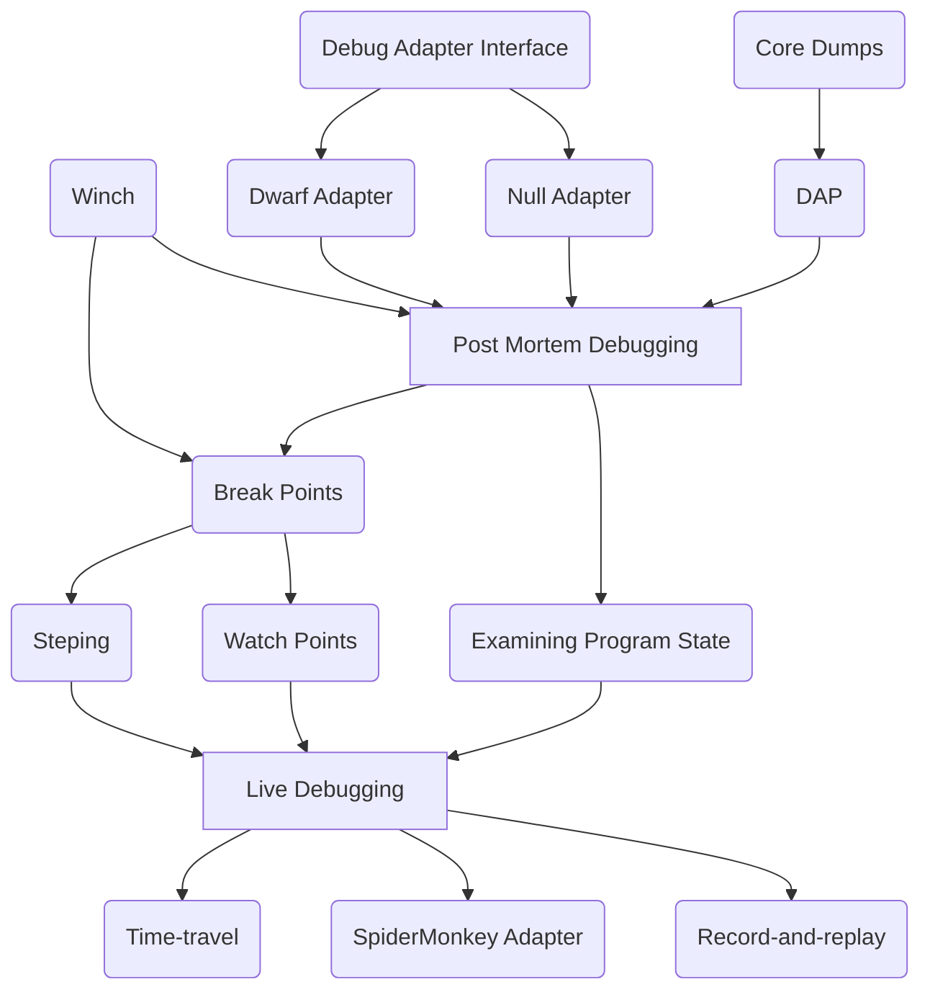

# Summary

Implement guest debugging capabilities in Wasmtime and integrate those abilities
with surrounding debugging toolchains.

## Motivation

Debugging is a fundamental part of the software development lifecycle, and Wasm
is not exempted from this requirement. Adoption of Wasm in any production
context will depend on the ability of developers to debug the programs they are
writing, and the current state of debugging in Wasmtime is not sufficient.
However, the few assumptions that Wasm is allowed to make of its execution
environment makes it extremely suitable for debugging: the only non-determinism
present in wasm execution creeps in via calls to imported functions.

We want to set the bar high for Wasm debugging in Wasmtime, by holding to the
following principles:

1. **Smooth Developer Experiences:** Our debugging tools should be familiar and
   easy to use; diagnosing and fixing your program’s bugs is already hard enough
   without needing to learn new paradigms or fight to configure tooling just
   right. Developers expect features for inspecting live-running debuggees like
   breakpoints, stepping, watchpoints, and examining program state. We should
   provide developers these features and we should do so in a way that
   integrates well with their existing development environments.

2. **Support Both Languages Compiled to and Interpreted Within Wasm:** As Wasm
   is used as a target for both compiled and interpreted languages, we want to
   set ourselves up to support debugging either kind of source program through
   the same interface. Wasmtime should be the one-stop-shop for debugging all
   programs running within it.

3. **Leverage Wasm’s Strengths:** We want to leverage, for example, the
   relatively non-deterministic nature of Wasm execution to enable compelling
   debugging features like post-mortem debugging a failure from production
   locally, deterministic record and replay, and time-travel debugging. We
   should be able to take advantage of Wasm’s clear state boundaries and lack of
   implicit state to build tooling that would otherwise be prohibitively
   difficult for other debuggees.

Support for debugging Wasm modules written in a variety of languages is an
absolute must for a future that involves the component model; the seamless
debugging of components that are compositions of modules written in different
languages is what this RFC strives to enable.

# Proposal

## Overview

We plan to take an iterative approach to implementing debugging capabilities in
Wasmtime, beginning with an initial component-based debug adapter with support
for targeting Wasm and DWARF metadata, tooling for generating and examining core
dumps, facilitating investigation of those core dumps via the Debug Adapter
Protocol, and finally live debugging. Additional features like record+replay,
time-travel debugging, and support for debugging interpreted languages can be
built on top of that foundation. Initial efforts will focus on local debugging,
however remote debugging capabilities should be straightforward to build on top
of the foundation we outline here.

## Core Dumps

Core Dump support will be implemented following the [spec in the
WebAssembly/tool-conventions
repository](https://github.com/WebAssembly/tool-conventions/blob/main/Coredump.md).
Core dump generation has been implemented already, although the values of locals
and the operand stack are not captured and tooling to consume core dumps is
currently quite limited.

Users can enable core dump generation by passing a --coredump-on-trap flag to
the cli, or by directly setting `coredump_on_trap` to `true` on the
`wasmtime::Config`. Wasmtime will then generate a core dump on a trap, which
will then enable offline debugging of the error. As other embedders of Wasmtime
will likely need more fine-grained control over the ability to produce core
dumps, we will also add a callback api to enable the decision to capture a core
dump to have more context present. For example, you may want to capture exactly
one core dump per customer and only generate a new one if there is not currently
one cached, or would like to allow the disabling of core dump generation
entirely for a subset of the wasm modules being run.

Preserving core dump information (ie. locals and operand stack) is somewhat
straightforward in the case of the baseline compiler, Winch, because that
information isn’t at risk of getting optimized away. Preserving the same
information in Cranelift is less straightforward and will require additional
bookkeeping. The general approach we can take for that is to have the
cranelift-wasm frontend annotate wasm locals to be preserved, and for the
operand stack we can use our existing system of preserving metadata in egraphs.
This should allow us to have best-effort core dumps from cranelift without
overly pessimizing optimization.

While it will be possible to generate core dumps from code compiled with
Cranelift, we do accept that it won’t have the same level of detail available to
Winch. As the wasm core dump format is defined in terms of the wasm execution
model and is independent of the strategy used to execute that wasm, we will be
able to use core dumps generated by code produced by either Cranelift or Winch
when debugging. Being able to use a core dump generated by code compiled with
Cranelift when debugging with Winch is extremely powerful, as it means that we
don’t need to sacrifice the performance of generated code to enable debugging
with a core dump. Additionally, as Winch will have more information available
when debugging, the core dump produced by code compiled with either backend will
be sufficient to get the debugger into a state where we have high-fidelity
information available.

## Debug Adapter Protocol

We plan to add initial support for the [Debug Adapter Protocol
(DAP)](https://microsoft.github.io/debug-adapter-protocol/) into wasmtime. This
will involve adding an execution mode like `wasmtime --dap` or `wasmtime
--debug`, which will expose a debug adapter. The idea here is to allow DAP
clients to consume core dump information from Wasmtime, enabling users to start
doing post-mortem debugging, and acting as a forcing function for us to
implement and verify basic protocol support before moving onto live debugging
use-cases.

Why the debug adapter protocol? [Like the Language Server Protocol
(LSP)](https://microsoft.github.io/language-server-protocol/) the Debug Adapter
Protocol allows for a client-agnostic implementation of the debugger.
Traditionally tools like gdb or lldb provide their own front-end for interacting
with programs that are being debugged, but this requires changing out of a
user’s more familiar development environment when switching to a debugging
workflow. The Debug Adapter Protocol provides a separation that allows for
supporting editors (like
[VSCode](https://code.visualstudio.com/api/extension-guides/debugger-extension),
[Emacs](https://www.emacswiki.org/emacs/DebugAdapterProtocol), and
[neovim](https://neovim.io/doc/user/lsp.html)) to directly implement setting
breakpoints and interacting with programs that are being debugged, instead of
requiring the use of a different tool. Targeting the Debug Adapter Protocol will
allow Wasmtime developers to focus on the implementation of debugger primitives,
rather than the user experience of debugging programs. In addition to the
features we outline in the [Live Debugging](#live-debugging) section below, the
DAP supports debugging debuggees that cannot step or set breakpoints (such as
core dumps) and debuggees that can reverse step (such as time-traveling while
replaying a recorded trace). Many other debugging protocols do not have these
features. Given all these things, we have good support for principle (1):
providing a smooth developer experience.

While there are some existing crates that implement support for the Debug
Adapter Protocol, the breadth of selection that we would have available for
selecting a Language Server Protocol implementation is not available. We will
proceed by evaluating the [dap](https://crates.io/crates/dap) crate as a
possible dependency for our implementation, falling back on implementing the
protocol by hand if necessary.

## Debug Adapter Components

As we would like the Wasmtime debugger to be able to understand the source
language of any Wasm that it’s executing, we’re presented with a problem: how
can we foresee all possible kinds of debuggee programs, compiled or interpreted,
and provide a unified debugging interface to them? Instead of solving this
impossible problem, we propose using the component model to design an interface
for a debug adapter. A debug adapter will import a private interface that gives
it low-level access to the underlying Wasm debuggee, and will export a
higher-level interface that the debugger will interact with and query. This
allows us to uphold our principle of supporting debugging anything compiled to
Wasm; we just need a debug adapter component to bridge the gap between the
high-level source language and low-level Wasm semantics.

We will implement two adapters:

1. **The Null Debug Adapter:** A debug adapter that forwards all queries
   directly to the underlying Wasm being executed. This provides Wasm-level
   debugging to the developer.

2. **The DWARF Debug Adapter:** A debug adapter component that translates
   queries from the debugger through the source program’s DWARF debug info
   custom sections. This enables the debugging of programs compiled to Wasm,
   such as Rust, C, C++, etc… 

Interpreters that are compiled to Wasm can, in the future, provide their own
debug adapter components that translate debugging queries through their runtime
data structures to inspect debuggee programs being interpreted within
themselves.

Even further into the future, we can collaborate with the WebAssembly Community
Group to standardize debug adapter components (or something evolved from them)
in the ``WebAssembly/tool-conventions`` and `WebAssembly/component-model`
repositories.

While the exact WIT interface of and world for debug adapter components is out
of scope for this RFC, and will require experimentation and prototyping during
implementation, we expect that it will closely mirror the kinds of queries
supported by the Debug Adapter Protocol.

## Live Debugging

Live debugging support comprises several features, each of which comes with
design and implementation considerations. These features are: setting
breakpoints, single stepping, watch points, step into/out of, and integration
with our existing baseline compiler Winch.

### Breakpoints and Single-stepping

To implement breakpoints and single-stepping, we need the ability to pause
program execution and wait for user input prior to executing a specific line of
code. The way this is handled in native debuggers is as follows:

* When a user sets a breakpoint, the instruction corresponding to that line of
  code is replaced with an `int3` instruction.

* When executed, the `int3` instruction raises a `SIGTRAP`, halting execution
  and yielding control back to the debugger.

This approach leads to a problem for us: we only have one compiled copy of a
module’s code, even though multiple instances may be running the code. So if we
just replace an instruction in the code with an interrupt, it is possible that a
different instance will hit that interrupt. At that point, in order for that
instance to continue executing we need to swap in the actual instruction. This
leads to a race condition between the instances where we aren’t guaranteed that
our breakpoint will actually interrupt when we need it to! We can get around
this in the following way:

1. When code is compiled for debugging, for every instruction emitted, emit a
call to a utility function that can check if execution should be paused:

2. When a breakpoint is set, the function will pause execution, allowing for
resumption later on

3. When an instance hits that breakpoint it can automatically continue if it
isn’t intended to stop, otherwise it can wait for user input.

We will need to keep track of some information for every wasm opcode in our
program: what program counter the opcode is, the size of its operand stack, and
which entry in the operand stack the opcode is in terms of machine state. All of
this information can be serialized and passed into the utility function present
in the `<check for breakpoint>` pseudo opcodes above.

### Watchpoints

Watchpoints for locals, globals, and table elements can be converted to
breakpoints by statically checking for local.set, global.set, and table.set
instructions. Memory watchpoints— pausing execution when a program writes to a
specific memory location— are a little bit trickier to accomplish. However, like
the proposed implementation for single-stepping mentioned in the [previous
section](#breakpoints-and-single-stepping), we can implement watch-points by
instrumenting all store operations with a similar call out to a utility
function. The call sites (store instructions) would have enough local
information available to determine if a watchpoint would trigger, and could
provide us with another implementation path that would avoid modifying the
signal handler.

### Step into / out of

Stepping into a function means pausing execution on the first instruction
_inside_ a function that is about to be called. We can accomplish this by
setting a temporary breakpoint on that first instruction, but first we need to
figure out the address of the function we are about to step into. For direct
function calls, we can set a breakpoint at the start of the static callee. For
indirect calls, as long as we pause immediately before the indirect branch, we
can see which func index we are about to call and set a breakpoint accordingly.

Alternatively, as we are already inserting various bookkeeping function calls
elsewhere in the function body during code generation, we could track one bit of
global information that indicates whether or not a function should break
immediately on entry, checking and potentially clearing that bit at every
function entry. This would allow us to step into functions by setting that bit
while in single-stepping mode before processing a call instruction, and then
clearing that bit once the next function has been entered. This implementation
adds some overhead by requiring that we are already stepping before the call
instruction is processed, but does simplify implementation details by not
requiring special handling of indirect calls.

Stepping out of a function is a bit easier to implement, as it will require us
to stop execution at any instruction that could cause the function to return
(branches with a sufficiently large stack depth, or a return instruction), and
then single-step out. For tail calls we have multiple options: we could treat
stepping out as breaking when the next function is entered, or we could break
once we finally return from the tail callee.

### Winch Considerations

Interactive debugging support in an optimizing compiler like Cranelift would
require fundamental changes to how optimizations are applied and how program
state is tracked throughout compilation. Maintaining compiler performance while
integrating those changes would be a significant undertaking. For this reason,
for the foreseeable future, we are only going to support live debugging with
Wasmtime’s baseline compiler: Winch.

Winch will require some additional features to enable the debugging workflows
outlined above:

* The visitor that Winch uses to translate Wasm opcodes to native code will need
  to be augmented to enable the interleaving of calls to local utility functions
  that check for breakpoint/watchpoint status.

* We will need to either maintain a mapping from locals to register/stack slot
  for all Wasm PC points that we might hit a breakpoint or watchpoint, or force
  winch to unconditionally spill locals to the stack. The latter would greatly
  simplify tracking local locations, while the former would greatly increase the
  amount of context we would need to pass into the utility function for
  inspecting the execution state.

# Future Work

## Source Language Debugging

While DWARF metadata is enough to enable debugging compiled languages, it
doesn’t really help with debugging a running interpreter that has been compiled
to Wasm — debugging that wasm module would amount to debugging the interpreter,
not the underlying program being interpreted. Let’s examine this through two
examples: debugging a Rust program compiled with DWARF annotations, and
debugging a JavaScript programming being interpreted by SpiderMonkey compiled to
Wasm.

In the case of debugging compiled Rust that has DWARF annotations present, all
of the existing workflows we described in this document would apply: source line
mappings and the locations of local variables would all be determined by
translating directly back to offsets in the wasm module. However if we’re
debugging javascript running on SpiderMonkey compiled to Wasm, DWARF annotations
would only give us information about the spidermonkey interpreter; we need to
instruct the debugging infrastructure provided by SpiderMonkey to proceed with
source-level debugging.

The difference between these two workflows suggests that a debugger
implementation in Wasmtime needs to understand the target being debugged at a
deeper level than just annotations. To address this problem, we plan to enrich
the debug adapter interface described for the null and DWARF adapters above with
enough information to allow control of a guest interpreter. This will include
the need to reflect on symbols exported by the interpreter allowing for
functions to be dynamically called by the debug adapter, reusing all of the
interpreter’s existing debugging facilities directly.

## Record + Replay

Once we have both core dumps and the live debugging capabilities described
above, we start to open the door to more interesting debugging capabilities. One
of those is the ability to record a trace in a production setting, and then
replay it in a debug environment to aid with the quick reproduction of a bug.
This is a major feature of the [rr](https://rr-project.org/) debugger, which is
able to record the results of syscalls and deterministically replay program
execution with that trace to enable easy debugging of otherwise
tricky-to-reproduce bugs. As WebAssembly execution is already well-sandboxed and
semi-deterministic, recording the result of calling imports would enable the
same sort of offline analysis of a production failure.

Additionally, once the facility for recording the results of imports exists, the
ability to rewind execution likewise becomes possible. Using the import calls or
snapshotting the state of execution at a regular interval, we can produce
keyframes that we are able to play execution forward from, enabling us to
support time-travel debugging. As the Debug Adapter Protocol already supports
stepping backwards through program execution, we would be well set up to
leverage existing user interfaces for this sort of debugging, and would not need
to innovate on the user experience beyond providing the base functionality in
Wasmtime itself.

Snapshotting Wasm execution is simpler than what would be necessary to snapshot
an arbitrary executable: all the information necessary for snapshotting is
present in the process executing the Wasm. This is a great example of our
principle of Leveraging Wasm’s Strengths enabling features that would be
extremely complicated to implement in a different context.

# Implementation Plan

We define two major milestones in this implementation plan: first, post-mortem
debugging with core dumps, and second, live debugging support. Our focus in
defining and organizing these milestones has been to prioritize building
valuable source-level tooling for developers, and doing so quickly and
incrementally.

For the first milestone, post-mortem debugging, support for generating core
dumps has already been added to Wasmtime, though there is some work remaining to
capture locals and values from the operand stack. These will always be
incomplete for Cranelift, but we should be able to capture them with full
fidelity when using Winch. The work remaining for this milestone is the
integration of a DAP server, which will require the evaluation of existing
crates to determine if they will suit our needs, and the design and
implementation of a minimal debug adapter interface that’s sufficient to
implement both the null and DWARF debug adapters for core dump debuggees. This
milestone both provides value to users, who will be able to do things like
locally debug failures from production, and also serves as a forcing function to
implement the foundations we need for the next milestone.

The second milestone encompasses features necessary for a smooth, familiar Wasm
debugging experience with a DAP enabled editor. Breakpoints are listed as a
prerequisite for most other live-debugging features, as their behavior will be
reused or extended. Once breakpoints have been implemented, the implementation
of watch points, and step into can be done in parallel. As examining program
state doesn’t require the ability to manipulate control flow while debugging, it
can be built entirely off of the work required to support Post Mortem Debugging.

Finally, the implementation of time-travel, record-and-replay, and interpreted
(e.g. JS inside SpiderMonkey) debugging is left largely unspecified, as we will
likely need to reevaluate their designs once we’ve finished the basic
implementation of live debugging in Wasmtime.

# Rationale and Alternatives

## GDB or LLDB

We could proceed instead by building workflows around an existing debugger
that’s attached to Wasmtime itself. This would facilitate debugging at the Wasm
level and the level of compiled modules, but would fall a little short when it
comes to facilitating debugging interpreted languages. It would also require
that users interact with the debugger using gdb’s native interface or through a
Debug Adapter Protocol interface built on top of gdb requiring additional setup
and configuration. We would need to build additional abstractions on top of gdb
to support the same sort of interface that we’ve described for supporting
interacting with SpiderMonkey’s debugger, and at that point we would be
complicating our ability to support time-travel debugging or record+replay in
the future by switching from debugging Wasm to debugging native code.

Choosing an existing debugger like gdb or lldb would compromise our three
principles outlined in the [motivation](#motivation) section &mdash;
particularly principle (2) and supporting interpreted debuggees[^possible]
&mdash; and therefore we feel that they are not viable choices.

[^possible]: We think it is *probably*, *technically* possible to implement
debugging interpreted programs in `gdb` or `lldb` through their plugin
interfaces. However, we believe that the user experience would be somewhat
clunky and the implementation difficult.

## Breakpoints

Instead of inserting calls to a utility function to check for breakpoints set at
a specific instruction, we could insert `nop` instructions. Those `nop`
instructions would be overwritten with `int3` instructions to generate `SIGTRAP`
when executed, allowing us to then make a decision about either continuing if
the execution was from an unrelated instance, or actually pausing execution and
yielding control to the debugger.

One significant complication here would be passing the metadata required by the
breakpoint handler is no longer as simple: we would need to recover that
information in the signal handler instead of having it passed into the utility
function called between each instruction. Additionally, this would complicate
the signal handler for Wasmtime.

## Watchpoints

An alternative to the approach for implementing memory watchpoints above is to
use a similar mechanism to what we use for eliding bounds checks: we can have
virtual memory mapped in with write-permissions off. Then, any time the guest
program tries to write to that page, a signal will be raised. Our signal handler
will then check if the address being written to is in our watch-list. If yes,
then pause execution and wait for user input. If not, then we perform the write
and resume. This approach introduces similar new complexity into our signal
handler as the alternative implementation for breakpoints, however it also
avoids the additional overhead of calling into a local utility function for each
memory write. Similar to the breakpoint implementation outlined above, it would
also require recovering the context for a watchpoint through a mechanism other
than function arguments.

# Open Questions

* For stepping out of functions that tail call, should we treat the callee as
  the break point, or break when we’re actually popping off a stack frame?

* What should the CLI for specifying either core dumps or a remote port to
  attach to look like? We will need a flag to indicate that a DAP server should
  be started, 

# References

* [The Wasm core dump specificiation](https://github.com/WebAssembly/tool-conventions/blob/main/Coredump.md)
* [The Debug Adapter Protocol](https://microsoft.github.io/debug-adapter-protocol/)
* [The Langauge Server Protocol](https://microsoft.github.io/language-server-protocol/)
* [The `dap` crate](https://crates.io/crates/dap)
* [The `rr` debugger](https://rr-project.org/) 
