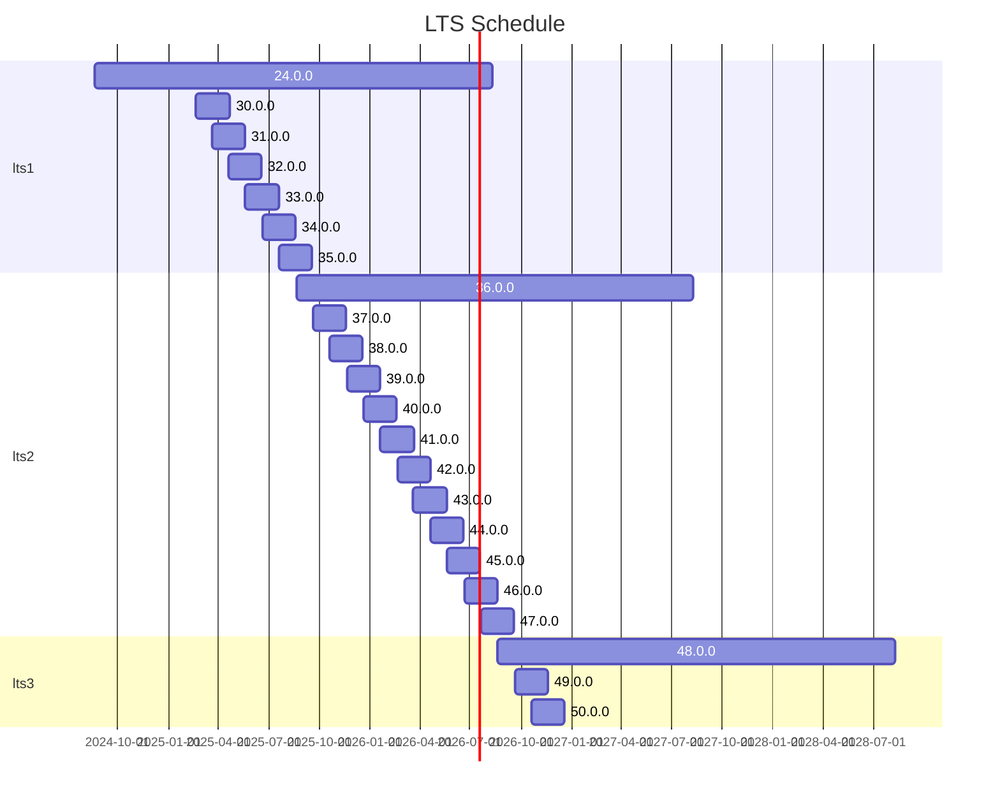

# Summary

[summary]: #summary

Add a Long Term Support (LTS) channel of releases for Wasmtime. LTS releases for
Wasmtime will be every 12 versions at versions starting at 24.0.0. LTS releases
are supported for 24 releases (2 years) to ensure that there is always at least
two LTSes at any one point in time.

# Motivation
[motivation]: #motivation

Currently Wasmtime's [release process][process] is such that a new release is
made once a month. Security patches are guaranteed for the current and previous
release of Wasmtime, meaning that a release of Wasmtime receives guaranteed
security updates for two months. This release/security cadence was designed a
few years back when Wasmtime was first release and it was known at the time that
it was pretty aggressive in terms of support and dropping older versions and
that we might want to revisit it in the future. Essentially, now seems as
reasonable a time as any to reconsider this.

As Wasmtime has matured it's clear that not all possible users of Wasmtime will
find the current release cadence reasonable. Embeddings might not have the
energy/resources to track the once-a-month release of Wasmtime but at the same
time still desire security updates. Currently there's not much that can be done
other than hope for the best when using Wasmtime.

Supporting an LTS channel for Wasmtime, however, is not free. The original
rationale for not supporting it is that it costs engineering resources to
maintain and additionally no current users needed that. While the latter part of
this equation is being reconsidered it's worth going over the costs of an LTS
with as well. Some more discussion can be found in [#10161][issue], but a
summary is:

* Security updates are required for an LTS. For 2023 and 2024 Wasmtime had 8
  CVEs and all were generally easy to backport. Overall the prediction is that
  we won't be spending all our time trying to figure out how to backport CVEs to
  older branches of Wasmtime.

* Bug fixes are likely going to be optional for an LTS. If an LTS release
  doesn't guarantee we backport all bug fixes then we don't have to always do
  the work of backporting and identifying bug fixes. It's assumed, though, that
  bug fix backports will always be accepted regardless so long as someone's
  willing to do the work.

* Feature backports are currently planned to not be supported at all, even if
  someone's willing to do the work to backport it. In addition to being
  significantly more difficult to review large additions to old snapshots of the
  codebase the rationale is that we want to reduce the risk of bugs being
  accidentally introduced into an LTS.

* Long release windows have a risk of rushing all pending features in just
  before a new release is made, and this is a theoretical concern about
  attempting to rush a feature in before an LTS branch is cut. This concern is
  projected to be mitigated by the normal release schedule, however, where if
  new features are necessary for an embedding it can ride that release train
  (updating each month) until the next LTS and then ride the LTS.

* Release automation atrophying is a chief concern that still needs mitigation.
  The current thinking is to somehow do a "dry run" periodically and ensure that
  the automation is up-to-date to remind maintainers to take a look and backport
  any CI tweaks as necessary. This is mostly mitigated by pinning rustc versions
  but breakage inevitably still occurs.

The general summary though is that an LTS has always been well-motivated and
now seems about right to implement it. The reasons to not initially do an LTS
are not as applicable nowadays, hence this RFC.

One final question that's reasonable to address here is "why now?" For example
why propose an LTS release now when there isn't necessarily a cohort of dozens
of embedders all banging on the door asking for it. The main rationale is that
if we have dozens of such embedders it's probably too late to start an LTS at
that time and it should have been done many moons earlier. Effectively the goal
of this RFC is to signal to the community that the project is ready for LTS
channels and users which may have been hesitant to Wasmtime might be convinced
by this change. It's not expected we'll see anything like a massive influx of
users, but instead this is generally what's expected of a well-established open
source project with critical security requirements.

[process]: https://docs.wasmtime.dev/stability-release.html
[issue]: https://github.com/bytecodealliance/wasmtime/issues/10161

# Proposal
[proposal]: #proposal

Wasmtime will add a new type of release to its release process, a Long Term
Support (LTS) release. LTS releases will happen every 12th release of Wasmtime
(once a year), starting with 24.0.0 (retroactively classified as LTS). Each LTS
will be supported for 24 versions, or 24 months/2 years. Overlapping LTS
windows enables users of the LTS release to upgrade on their own time from one
LTS to another. At this time though it's expected that LTS users will likely
upgrade from one LTS to another, for example a user of 36.0.0 could upgrade to
48.0.0 as late as when 52.0.0 is released.

LTS releases for Wasmtime will have the following properties:

* Security fixes for CVEs are guaranteed to be backported to LTS releases.
* Bug fixes are not guaranteed to be backported, but anyone can request a
  backport or send a PR which will be reviewed to backport a bug fix. Bug fixes
  are required to land on `main` first, however.
* New features are not supported on LTS releases, even if someone sends a PR.
* Backports are required to not increase the minimum-supported-Rust-version
  (MSRV) from when the LTS branch was created. This means that the same version
  of Rust can be used to compile an LTS branch for its entire lifecycle.
* Platform compatibility of LTS branches may change over time as build
  containers/distributions reach EOL. For example if a GitHub Actions runner is
  discontinued during the lifecycle of an LTS and it's in use for that LTS's CI,
  then we'll be forced to update the image which may increase the platform
  compatibility. We'll always strive to update as minimally as possible if an
  update is required.

LTS releases will be automated the same way all releases are managed for
Wasmtime today. A dedicated `release-N.0.0` branch is created and then further
releases are made from that branch. Subsequent releases of LTSes for CVEs or bug
fixes will be versioned by incrementing the patch version of semver, for example
36.0.1. A patch release is made via [today's release process][patches]

Wasmtime will continue to guarantee security fixes and support bug fix backports
for the current release of Wasmtime and the previous release of Wasmtime as
well. For example if the current release is 47.0.0 then a CVE will trigger a
release of 24.0.1 (lts), 36.0.1 (lts), 46.0.1 (n-1), and 47.0.1 (n).

To see this proposal visually this is a diagram of when a release starts (the
start of its box) to the final date such a release receives security fixes (the
end of its box)

This means that once two LTS channels are in play there will 4 releases of
Wasmtime which receive security fixes at any one point in time.

[patches]: https://docs.wasmtime.dev/contributing-release-process.html#releasing-a-patch-version

## Schedule Constraints

There are a number of possibilities around how exactly to set the parameters for
LTS. Here it's chosen that an LTS happens once-a-year at versions divisible
by 12. Versions are then supported for 24 months. This cadence is specifically
chosen to enable users to update Wasmtime once per year and always be on a
supported LTS version. This is seen as a good rule of thumb we can give
embedders where they get to choose when during the year to upgrade so long as
one upgrade happens per year.

## LTS and CI

While a relatively boring topic for most the integration of Continuous
Integration (CI) into Wasmtime's release process means that this can't go
entirely un-mentioned from this RFC. While Wasmtime generally pins versions of
dependencies (e.g. rustc) in CI it inevitably has breakage over time in
situations such as:

* GitHub Actions might retire an image (e.g. `ubuntu-20.04`) completely.
* We might discover that our CI accidentally depends on a live service that goes
  offline.
* We might discover bugs in our CI configuration which need fixing.

In all of these scenarios we don't want to discover this when a CVE is being
released -- there's nothing worse than trying to debug 10-month-old CI
configuration and puzzling over what's going wrong. To address this situation
this RFC proposes new automation to ensure that release branches are kept
up-to-date and green at all times, always ready to make a release.

The specific changes that will be made to Wasmtime's CI is:

* A new [`workflow_dispatch` trigger][wdtrigger] will get added to the
  `main.yml` CI.
* A new `schedule` cron job-based action will be added to the `main` branch of
  Wasmtime (the `schedule` trigger [only works on the main branch][ghamain]).
  This new job will run once-a-week.
  * A script will be added to the repository to calculate the current set of LTS
    branches.
  * This script will execute [`gh workflow run`] for each release branch,
    executing the full `main.yml` CI for the release branch.
* CI will be updated to skip auto-publishing/tagging/etc when the trigger is
  `workflow_dispatch`.
* CI will be updated to file an issue on the repository using
  [actions/github-script] if the dispatched run fails (as otherwise
  notifications won't get sent out).

This should ensure that CI is at most 1 week old and only needs 1 week worth of
fixes which should always be pretty fresh in our minds. Otherwise this ensures
that our CI continues operating normally as it did at the time of the LTS branch
creation.

[ghamain]: https://docs.github.com/en/actions/writing-workflows/choosing-when-your-workflow-runs/events-that-trigger-workflows#schedule
[wdtrigger]: https://docs.github.com/en/actions/writing-workflows/choosing-when-your-workflow-runs/events-that-trigger-workflows#workflow_dispatch
[`gh workflow run`]: https://cli.github.com/manual/gh_workflow_run
[actions/github-script]: https://github.com/actions/github-script

## LTS and Features

As-specified LTS branches will receive no new feature development, even if
someone were to send a PR and request it be merged. Instead such a PR would
be closed saying "we don't support this." As mentioned in the [motivation]
section this can raise the risk of attempting to rush features in before an LTS
branch is cut to have them supported during that LTS cycle.

Mitigations for this release pressure are to (a) continue to support a
once-a-month release schedule and (b) communicate that users can still fork the
repository and backport the feature themselves. For (a) there are no changes to
Wasmtime's normal release process in this RFC so there's still a single release
every month, the only change is how long some releases are supported (aka LTS
releases). For (b) some production users are already doing this today and it's
expected that if both LTS and a feature which didn't make it are important that
it's reasonable to ask the user to maintain their own fork. Such a fork should
still be able to benefit from security backports made to the official LTS
branch.

# Rationale and alternatives
[rationale-and-alternatives]: #rationale-and-alternatives

* The major alternative to this design is to not support an LTS at all and
  continue on Wasmtime's current path of only guaranteeing the
  current-and-previous releases get security fixes. It's seen though that this
  is likely excluding too many potential users of Wasmtime, hence this RFC.

* Another alternative is to support only one LTS at a time. The problem with
  this is that users of an LTS should have a period of time to upgrade from one
  to the other where both LTS releases are supported. Otherwise if an upgrade
  takes an unexpectedly long time then if a security issue happens it won't get
  backported to the old LTS release.

# Open questions
[open-questions]: #open-questions

None at this time.
