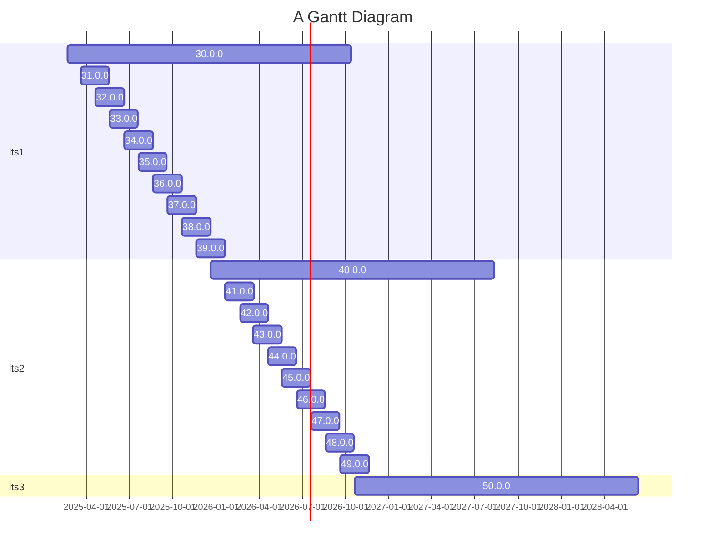

# Summary

[summary]: #summary

Add a Long Term Support (LTS) channel of releases for Wasmtime. LTS releases for
Wasmtime will be every 10 versions at versions `N0.0.0`. LTS releases are
supported for 20 releases to ensure that there is always at least two LTSes at
any one point in time.

# Motivation
[motivation]: #motivation

Currently Wasmtime's [release process][process] is such that a new release is
made once a month. Security patches are guaranteed for the current and previous
release of Wasmtime, meaning that a release of Wasmtime receives guaranteed
security updates for two months. This release/security cadence was designed a
few years back when Wasmtime was first release and it was known at the time that
it was pretty aggressive in terms of support and dropping older versions and
that we might want to revisit it in the future. Essentially, now seems as
reasonable a time as any to reconsider this.

As Wasmtime has matured it's clear that not all possible users of Wasmtime will
find the current release cadence reasonable. Embeddings might not have the
energy/resources to track the once-a-month release of Wasmtime but at the same
time still desire security updates. Currently there's not much that can be done
other than hope for the best when using Wasmtime.

Supporting an LTS channel for Wasmtime, however, is not free. The original
rationale for not supporting it is that it costs engineering resources to
maintain and additionally no current users needed that. While the latter part of
this equation is being reconsidered it's worth going over the costs of an LTS
with as well. Some more discussion can be found in [#10161][issue], but a
summary is:

* Security updates are required for an LTS. For 2023 and 2024 Wasmtime had 8
  CVEs and all were generally easy to backport. Overall the prediction is that
  we won't be spending all our time trying to figure out how to backport CVEs to
  older branches of Wasmtime.

* Bug fixes are likely going to be optional for an LTS. If an LTS release
  doesn't guarantee we backport all bug fixes then we don't have to always do
  the work of backporting and identifying bug fixes. It's assumed, though, that
  bug fix backports will always be accepted regardless so long as someone's
  willing to do the work.

* Feature backports are currently planned to not be supported at all, even if
  someone's willing to do the work to backport it. In addition to being
  significantly more difficult to review large additions to old snapshots of the
  codebase the rationale is that we want to reduce the risk of bugs being
  accidentally introduced into an LTS.

* Release automation atrophying is a chief concern that still needs mitigation.
  The current thinking is to somehow do a "dry run" periodically and ensure that
  the automation is up-to-date to remind maintainers to take a look and backport
  any CI tweaks as necessary. This is mostly mitigated by pinning rustc versions
  but breakage inevitably still occurs.

The general summary though is that an LTS has always been well-motivated and
now seems about right to implement it. The reasons to not initially do an LTS
are not as applicable nowadays, hence this RFC.

[process]: https://docs.wasmtime.dev/stability-release.html
[issue]: https://github.com/bytecodealliance/wasmtime/issues/10161

# Proposal
[proposal]: #proposal

Wasmtime will add a new type of release to its release process, a Long Term
Support (LTS) release. LTS releases will happen every 10th release of Wasmtime,
starting with 30.0.0. Each LTS will be supported for 20 versions, or 20 months.
This means that as of 40.0.0 there will always be 2 active LTS releases at the
same time. Overlapping LTS windows enables users of the LTS release to upgrade
on their own time from one LTS to another. In the most extreme case an embedding
could jump from 30.0.0 to 50.0.0 and always be on an LTS release (20 months
between updates).

LTS releases for Wasmtime will have the following properties:

* Security fixes for CVEs are guaranteed to be backported to LTS releases.
* Bug fixes are not guaranteed to be backported, but anyone can send a PR which
  will be reviewed to backport a bug fix. Bug fixes are required to land on
  `main` first, however.
* New features are not supported on LTS releases, even if someone sends a PR.
* Backports are required to not increase the minimum-supported-Rust-version
  (MSRV) from when the LTS branch was created. This means that the same version
  of Rust can be used to compile an LTS branch for its entire lifecycle.

LTS releases will be automated the same way all releases are managed for
Wasmtime today. A dedicated `release-N.0.0` branch is created and then further
releases are made from that branch. Subsequent releases of LTSes for CVEs or bug
fixes will be versioned by incrementing the patch version of semver, for example
30.0.1. A patch release is made via [today's release process][patches]

Wasmtime will continue to guarantee security fixes and support bug fix backports
for the current release of Wasmtime and the previous release of Wasmtime as
well. For example if the current release is 48.0.0 then a CVE will trigger a
release of 30.0.1, 40.0.1, 47.0.1, and 48.0.1.

To see this proposal visually this is a diagram of when a release starts (the
start of its box) to the final date such a release receives security fixes (the
end of its box)

This means that once two LTS channels are in play there will be anywhere from 3
to 4 releases of Wasmtime which receive security fixes at any one point in
time.

[patches]: https://docs.wasmtime.dev/contributing-release-process.html#releasing-a-patch-version

# Rationale and alternatives
[rationale-and-alternatives]: #rationale-and-alternatives

* The major alternative to this design is to not support an LTS at all and
  continue on Wasmtime's current path of only guaranteeing the
  current-and-previous releases get security fixes. It's seen though that this
  is likely excluding too many potential users of Wasmtime, hence this RFC.

* Another alternative is to support only one LTS at a time. The problem with
  this is that users of an LTS should have a period of time to upgrade from one
  to the other where both LTS releases are supported. Otherwise if an upgrade
  takes an unexpectedly long time then if a security issue happens it won't get
  backported to the old LTS release.

* There's always the possibility of supporting more LTS releases or supporting
  them for longer. The two-release and ten-versions-apart are relatively
  arbitrary at this time. Putting LTS releases 10 versions apart just makes them
  easy to identify (30, 40, 50, ...). While some overlap is required (e.g at
  least 11 months of support) it's not necessarily required to have 20 months of
  support. For now though it's predicted this won't be too onerous to support.

# Open questions
[open-questions]: #open-questions

- What is the exact process by which release automation does a "dry run" every
  so often? And how frequently is "every so often"?
